> ⚠️🏗️🚧🦺🧱🪵🪨🪚🛠️👷
> 
> This is a working draft in progress
> 
> 
> 
> gif image is provided by [Giphy](https://giphy.com)
> 
> ⚠️🏗️🚧🦺🧱🪵🪨🪚🛠️👷

----

# StormCrawler Project README - A diagrammatic version 
> **Disclaimer:**
>
> This document contains my personal notes on the topic,
> compiled from publicly available documentation and various cited sources.
> The materials are intended for educational purposes, personal study, and reference.
> The content is dual-licensed:
> 1. **MIT License:** Applies to all code implementations (Swift, Mermaid, and other programming languages).
> 2. **Creative Commons Attribution-ShareAlike 4.0 International License (CC BY-SA 4.0):** Applies to all non-code content, including text, explanations, diagrams, and illustrations.
---

# Apache StormCrawler: A Deep Dive 🕷️💨

Apache StormCrawler is an open-source collection of resources designed for building low-latency, scalable web crawlers. It leverages the power of [Apache Storm](http://storm.apache.org/) for distributed stream processing. The project is licensed under the [Apache License 2.0](http://www.apache.org/licenses/LICENSE-2.0) and is primarily written in Java.

---

## 🎯 Core Goal

To provide a flexible and robust framework for developers to create custom web crawlers that can handle large volumes of data with minimal delay.

---

## 🏛️ Ecosystem Overview

StormCrawler doesn't exist in a vacuum. It interacts with several other key technologies to provide its functionality.

<details open>
<summary>Click to show/hide the full native DOT implementation</summary>


</details>


This diagram illustrates:
*   A **Developer/User** :🧑‍💻 interacts with the **Maven Archetype** to generate a new **StormCrawler Project**.
*   This project depends on **StormCrawler Core** libraries.
*   The project is configured using files like `crawler.flux` and `crawler-conf.yaml`.
*   **Apache Maven** :hammer_and_wrench: is used to build the project and manage dependencies.
*   The crawler itself runs as a topology on an **Apache Storm Cluster** :cyclone:.
*   **Java 17+** :coffee: is a fundamental requirement.
*   **Docker** :whale: is needed if you intend to run the tests.

---

## 🚀 Quickstart Guide

Getting a basic StormCrawler instance up and running is straightforward, especially using the Maven archetype.

**Prerequisites:**
1.  **Apache Maven** installed ([Installation Guide](https://maven.apache.org/install.html)).
2.  **Apache Storm 2.8.0** installed ([Downloads](http://storm.apache.org/)).
3.  **Java 17 or above.**
4.  **Docker** environment (if running tests).

**Steps:**

```mermaid
---
title: "Quickstart Guide"
author: "Cong Le"
version: "1.0"
license(s): "MIT, CC BY-SA 4.0"
copyright: "Copyright (c) 2025 Cong Le. All Rights Reserved."
config:
  layout: elk
  theme: base
  look: classic
---
%%%%%%%% Mermaid version v11.4.1-b.14
%%%%%%%% Available curve styles include the following keywords:
%% basis, bumpX, bumpY, cardinal, catmullRom, linear, monotoneX, monotoneY, natural, step, stepAfter, stepBefore.
%%{
  init: {
    'flowchart': { 'htmlLabels': true, 'curve': 'basis' },
    'fontFamily': 'Comic Sans MS, cursive, sans-serif',
    'themeVariables': {
      'primaryColor': '#F3E333',
      'primaryTextColor': '#145A32',
      'lineColor': '#F8B229',
      'primaryBorderColor': '#27AE60',
      'secondaryColor': '#EBDEF0',
      'secondaryTextColor': '#6C3483',
      'secondaryBorderColor': '#A569BD',
      'fontSize': '15px'
    }
  }
}%%
flowchart TD
    A["Install Apache Maven"] --> B["Install Apache Storm 2.8.0"]
    B --> C["Ensure Java 17+ is active"]
    C --> D{"Want to run tests?"}
    D -- Yes --> E["Install Docker"]
    D -- No --> F["Generate Project via Maven Archetype"]
    E --> F
    F -- Run Command --> G["<code>mvn archetype:generate ...</code>"]
    G --> H["Enter Project Details <br/> e.g., groupId, artifactId, version, user-agent"]
    H --> I["Project Directory Created! 🎉"]
    I --> J["Navigate to Project Directory"]
    J --> K["Follow README instructions in new project"]
```



**Maven Archetype Command:**  
Execute this in your terminal:
```bash
mvn archetype:generate -DarchetypeGroupId=org.apache.stormcrawler -DarchetypeArtifactId=stormcrawler-archetype -DarchetypeVersion=3.3.0
```
You'll be prompted for:
*   `groupId` (e.g., `com.mycompany.crawler`)
*   `artifactId` (e.g., `mycrawler`) - this will also be your project directory name.
*   `version` (e.g., `1.0-SNAPSHOT`)
*   `package` (e.g., `com.mycompany.crawler`)
*   `agentName`, `agentVersion`, `agentURL`, `agentEmail` - for the User-Agent string.

**What the Archetype Creates:**  
The archetype doesn't just create a `pom.xml` with dependencies; it bootstraps a complete project structure.


*   **`CrawlTopology.java`**: Your main class that defines the Storm topology.
*   **`crawler.flux`**: A [Flux](https://storm.apache.org/releases/current/flux.html) file defining the Storm topology components and their connections. This is where you define your spouts and bolts for crawling.
*   **`crawler-conf.yaml`**: The primary configuration file for StormCrawler specific settings (e.g., fetch intervals, user agent details if not from archetype).
*   Other files in `src/main/resources/` provide default configurations for various aspects like URL filtering, Elasticsearch indexing, etc.

**Alternative Setup (Manual):**  
If you prefer not to use the Maven archetype, you can manually copy the resources from the [archetype-resources](https://github.com/apache/stormcrawler/tree/master/archetype/src/main/resources/archetype-resources) directory on GitHub.

**Core Concept: The Crawler Topology 🌀**  
The `crawler.flux` file is central to defining your crawler. It describes a directed acyclic graph (DAG) of spouts (data sources) and bolts (data processors).


This is a simplified, conceptual representation. The actual components and their connections are detailed in your `crawler.flux` file and configured via `crawler-conf.yaml`.

---

## 🆘 Getting Help

If you encounter issues or have questions:
1.  📚 **[WIKI](https://github.com/apache/stormcrawler/wiki)**: A great starting point for documentation and common questions.
2.  ❓ **StackOverflow**: Use the tag [`stormcrawler`](http://stackoverflow.com/questions/tagged/stormcrawler).
3.  🗣️ **GitHub Discussions**: Ask questions in the [discussions section](https://github.com/apache/stormcrawler/discussions).
4.  🏢 **Commercial Support**: A list of companies providing commercial support is available on the [project website](https://stormcrawler.apache.org/support/).

---

## 🛠️ Contributing & Building from Source

Contributions are welcome! 🤗

**Code Formatting:**  
Before submitting a Pull Request (PR), please format your code:
```bash
mvn git-code-format:format-code -Dgcf.globPattern="**/*" -Dskip.format.code=false
```
To enable pre-commit format hooks (recommended):
```bash
mvn clean install -Dskip.format.code=false
```

**Contribution Workflow:**


**Build Requirements:**
*   JDK 17+
*   Apache Maven 3
*   Docker (if you want to run tests, which is highly recommended for contributors)

**Building:**  
It's a standard Maven build process:
```bash
# 1. Clone the repository (if you haven't already)
# git clone https://github.com/apache/stormcrawler.git
# cd stormcrawler

# 2. Build
mvn clean install
```

**Build Process Flow:**

```mermaid
---
title: "Build Process Flow"
author: "Cong Le"
version: "1.0"
license(s): "MIT, CC BY-SA 4.0"
copyright: "Copyright (c) 2025 Cong Le. All Rights Reserved."
config:
  layout: elk
  theme: base
  look: classic
---
%%%%%%%% Mermaid version v11.4.1-b.14
%%%%%%%% Available curve styles include the following keywords:
%% basis, bumpX, bumpY, cardinal, catmullRom, linear, monotoneX, monotoneY, natural, step, stepAfter, stepBefore.
%%{
  init: {
    'flowchart': { 'htmlLabels': true, 'curve': 'basis' },
    'fontFamily': 'Comic Sans MS, cursive, sans-serif',
    'themeVariables': {
      'primaryColor': '#F3E333',
      'primaryTextColor': '#145A32',
      'lineColor': '#F8B229',
      'primaryBorderColor': '#27AE60',
      'secondaryColor': '#EBDEF0',
      'secondaryTextColor': '#6C3483',
      'secondaryBorderColor': '#A569BD',
      'fontSize': '15px'
    }
  }
}%%
flowchart TD
    AA["Clone StormCrawler Git Repo"] --> BB["Ensure JDK 17+, Maven 3 installed"]
    BB --> CC{"Want to run tests during build?"}
    CC -- Yes --> DD["Ensure Docker is running"]
    CC -- No --> EE["Run <code>mvn clean install -DskipTests</code> <br/>(Tests Recommended!)"]
    DD --> FF["Run <code>mvn clean install</code>"]
    FF --> GG{"Build Successful?"}
    EE -.-> GG
    GG -- Yes --> HH["Artifacts built! ✅"]
    GG -- No --> II["Build Failed ❌ - Check logs"]
```



**Note on Binary Files:**  
The project uses some binary files specifically for testing advanced crawler functionalities. These are located *only* within `src/test` directories of the relevant modules. They are not part of the core runtime dependencies.

---

## 🙏 Thanks

A special thank you to:

[](https://www.yourkit.com)

YourKit supports open source projects with its full-featured Java Profiler. YourKit, LLC is the creator of [YourKit Java Profiler](https://www.yourkit.com/java/profiler/index.jsp) and [YourKit .NET Profiler](https://www.yourkit.com/.net/profiler/index.jsp).

---

## 📖 References & Citations

*   Apache StormCrawler Official GitHub: [https://github.com/apache/stormcrawler](https://github.com/apache/stormcrawler)
*   Apache Storm: [http://storm.apache.org/](http://storm.apache.org/)
*   Apache Maven: [https://maven.apache.org/](https://maven.apache.org/)
*   Flux for Storm: [https://storm.apache.org/releases/current/flux.html](https://storm.apache.org/releases/current/flux.html)

----

I hope this detailed explanation with diagrams helps in understanding Apache StormCrawler better! 

Let me know if you have more questions. 😊


---

<!-- 


---
>**Licenses:**
>
>- **MIT License:**  [](LICENSE) - Full text in [LICENSE](LICENSE) file.
>- **Creative Commons Attribution-ShareAlike 4.0 International**: [CC BY-SA 4.0](https://creativecommons.org/licenses/by-sa/4.0/) [](https://creativecommons.org/licenses/by-sa/4.0/) - Legal details in [LICENSE-CC-BY-SA-4.0](THE_PAST/LICENSE-CC-BY-SA-4.0) and at [Creative Commons official site](https://creativecommons.org/licenses/by-sa/4.0/).
>
---
