> ⚠️🏗️🚧🦺🧱🪵🪨🪚🛠️👷
> 
> This is an ongoing document collecting notes for personal educational purposes and references. 
> 
> 
> 
> gif image is provided by [Giphy](https://giphy.com)
> 
> ⚠️🏗️🚧🦺🧱🪵🪨🪚🛠️👷

----

# Cut Your Losses in Large-Vocabulary Language Models

Click to show/hide the full disclaimer.

   
> <ins>📢 **Disclaimer** 🚨</ins>
>
> This document contains my personal notes on the topic,
> compiled from publicly available documentation and various cited sources.
> The materials are intended for 👨‍🎓 <ins>educational purposes</ins> 👨‍🎓 (<ins>:trollface:sometimes, entertainment purposes:trollface:</ins>), 📖 <ins> personal study </ins> 📖, and 🔖 <ins> technical reference </ins> 🔖.
> The content is dual-licensed:
> 1. **MIT License:** Applies to all code implementations (Swift, Mermaid, and other programming languages).
> 2. **Creative Commons Attribution-ShareAlike 4.0 International License (CC BY-SA 4.0):** Applies to all non-code content, including text, explanations, diagrams, and illustrations.

---

## 📜 Paper Citation

> Wijmans, E., Huval, B., Hertzberg, A., Koltun, V., & Krähenbühl, P. (2024). *Cut Your Losses in Large-Vocabulary Language Models*. arXiv preprint arXiv:2403.09009. Published as a conference paper at ICLR 2025.
> [https://github.com/apple/ml-cross-entropy](https://github.com/apple/ml-cross-entropy)

---

## Introduction: The Growing Pains of Large Vocabularies 😱

As Large Language Models (LLMs) become more powerful, their vocabularies—the set of all possible tokens they can understand and generate—also expand. While this improves expressiveness, it creates a massive computational bottleneck, specifically in the final cross-entropy loss layer during training.

The standard method computes a huge matrix of "logits" (raw prediction scores) for every single token in the vocabulary, for every token in a batch. This consumes an enormous amount of memory.

Let's visualize the problem.

```mermaid
---
title: "The Problem: The Growing Pains of Large Vocabularies 😱"
author: "Cong Le"
version: "1.0"
license(s): "MIT, CC BY-SA 4.0"
copyright: "Copyright © 2025 Cong Le. All Rights Reserved."
config:
  layout: elk
  theme: base
  look: handDrawn
---
%%%%%%%% Mermaid version v11.4.1-b.14
%%%%%%%% Available curve styles include the following keywords:
%% basis, bumpX, bumpY, cardinal, catmullRom, linear, monotoneX, monotoneY, natural, step, stepAfter, stepBefore.
%%{
  init: {
    'securityLevel': 'loose',
    'flowchart': { 'htmlLabels': true, 'curve': 'linear' },
    'fontFamily': 'Comic Sans MS, cursive, sans-serif',
    'themeVariables': {
      'primaryColor': '#22BB',
      'primaryTextColor': '#F8B229',
      'lineColor': '#F8B229',
      'primaryBorderColor': '#27AE60',
      'secondaryColor': '#6483',
      'secondaryTextColor': '#6C3483',
      'secondaryBorderColor': '#A569BD',
      'fontSize': '15px'
    }
  }
}%%
flowchart TD
    subgraph Standard_Cross_Entropy_Calculation["Standard Cross-Entropy Calculation"]
    style Standard_Cross_Entropy_Calculation fill:#F2F2,stroke:#333,stroke-width:2px, color: #FFFF
        E["Token Embeddings<br><b>E</b> <br/>(D x N)"]
        C["Classifier Weights<br><b>C</b> <br/>(D x |V|)"]
        
        subgraph GPU_Global_Memory["GPU Global Memory"]
        style GPU_Global_Memory fill:#22F2,stroke:#333,stroke-width:1px, color: #FFFF
        direction LR
            Logits["Huge Logit Matrix!<br><b>L = C<sup>T</sup>E</b><br>(|V| x N)"]
            Softmax["Softmax(L)<br>Probabilities"]
            Loss["Cross-Entropy Loss<br>Requires entire L"]
        end

        E -- "Matrix Multiply" --> Logits
        C -- "Matrix Multiply" --> Logits
        Logits --> Softmax
        Softmax --> Loss

        note["Memory Bottleneck! 🚨<br>Size is O(N * |V|)<br>For |V|=256k, N=8k, this is >16GB!"]
        Logits -- "This matrix dominates memory" --> note
    end
```

Essentially, most of the memory is used just to store a temporary matrix of scores, most of which correspond to tokens the model was never going to predict anyway.

----

## The Solution: Cut Cross-Entropy (CCE) 💡

The authors propose a clever method called **Cut Cross-Entropy (CCE)**. Instead of creating the giant logit matrix, CCE decomposes the cross-entropy calculation into two independent, memory-efficient parts.

The cross-entropy loss for a single ground-truth token $x_t$ can be expressed as:

$$
\ell_t(x) = - \log \frac{\exp(C_{x_t}^T E_t)}{\sum_{v=1}^{|V|} \exp(C_v^T E_t)} = \underbrace{-\left(C_{x_t}^T E_t\right)}_{\text{Part 1: Indexed Access}} + \underbrace{\log \sum_{v=1}^{|V|} \exp(C_v^T E_t)}_{\text{Part 2: Log-Sum-Exp (LSE)}}
$$

This decomposition is the magic behind CCE. Here's how it changes the data flow:

```mermaid
---
title: "The Solution: Cut Cross-Entropy (CCE) 💡"
author: "Cong Le"
version: "1.0"
license(s): "MIT, CC BY-SA 4.0"
copyright: "Copyright © 2025 Cong Le. All Rights Reserved."
config:
  layout: elk
  theme: base
  look: handDrawn
---
%%%%%%%% Mermaid version v11.4.1-b.14
%%%%%%%% Available curve styles include the following keywords:
%% basis, bumpX, bumpY, cardinal, catmullRom, linear, monotoneX, monotoneY, natural, step, stepAfter, stepBefore.
%%{
  init: {
    'securityLevel': 'loose',
    'flowchart': { 'htmlLabels': true, 'curve': 'linear' },
    'fontFamily': 'Comic Sans MS, cursive, sans-serif',
    'themeVariables': {
      'primaryColor': '#22BB',
      'primaryTextColor': '#F8B229',
      'lineColor': '#F8B229',
      'primaryBorderColor': '#27AE60',
      'secondaryColor': '#6483',
      'secondaryTextColor': '#6C3483',
      'secondaryBorderColor': '#A569BD',
      'fontSize': '15px'
    }
  }
}%%
flowchart TD
    subgraph CCE["Cut Cross-Entropy (CCE) Calculation ✨"]
    style CCE fill:#F2F2,stroke:#333,stroke-width:2px, color: #FFFF
        E["Token Embeddings<br><b>E</b> <br/>(D x N)"]
        C["Classifier Weights<br><b>C</b> <br/>(D x |V|)"]
        GT["Ground Truth Labels<br><b>x<sub>t</sub></b>"]

        subgraph Path_1["Path 1: Indexed Matrix Multiply"]
        style Path_1 fill:#F332,stroke:#333,stroke-width:2px, color: #FFFF
            E_idx["E<sub>n</sub>"] --> IM["Dot Product<br>C<sub>x<sub>n</sub></sub><sup>T</sup>E<sub>n</sub>"]
            C_idx["C<sub>x<sub>n</sub></sub>"] --> IM
            GT --> C_idx
        end

        subgraph Path_2["Path 2: Linear Log-Sum-Exp"]
        style Path_2 fill:#F399,stroke:#333,stroke-width:2px, color: #FFFF
            E_lse["E<sub>n</sub>"] --> LSE["Blockwise LogSumExp over all v<br>Σ exp(C<sub>v</sub><sup>T</sup>E<sub>n</sub>)"]
            C_all["Full C matrix"] --> LSE
        end
        
        E --> E_idx & E_lse
        C --> C_idx & C_all

        IM --> Combine["Combine<br>Loss = -IM + log(LSE)"]
        LSE --> Combine

        FinalLoss["Final Loss<br>Memory O(N) 💪"]
        Combine --> FinalLoss
        
        note["No huge intermediate matrix!<br>Memory cost is independent of |V|"]
        FinalLoss -- "Look Ma, No Logits!" --> note
    end
```

By splitting the task, CCE avoids building the $|V| \times N$ matrix entirely, making the memory footprint of the loss computation negligible.

---

## A Deeper Look: The CCE Algorithm 🧠

CCE is implemented using custom [Triton](https://triton-lang.org/main/index.html) kernels for maximum efficiency on GPUs. The process uses a **blockwise** or **tiled** approach to keep data in fast on-chip SRAM instead of slow global memory.

### Forward Pass Data Flow

This diagram shows how the LSE part of the forward pass is computed. It divides the large `C` and `E` matrices into smaller blocks that fit into the GPU's fast SRAM.

### Backward Pass & Gradient Filtering Optimization

The backward pass computes the gradients `∇E` and `∇C`. A key optimization here is **gradient filtering**. The softmax function produces a very sparse output: most vocabulary tokens have near-zero probability. CCE leverages this by skipping the gradient computation for any token whose probability is below a certain threshold (e.g., $2^{-12}$).

```dot
/*
 * title: Backward Pass & Gradient Filtering Optimization
 * author: Cong Le
 * version: 1.0
 * license(s): MIT, CC BY-SA 4.0
 * copyright: Copyright © 2025 Cong Le. All Rights Reserved.
 */
digraph CCE_Backward_Pass {
    rankdir=TB;
    splines=line;
    node [shape=box, style="filled,rounded", fontname="Helvetica"];
    edge [fontname="Helvetica"];

    subgraph cluster_global_in {
        label="Inputs from Global Memory";
        bgcolor="#fde0dc";
        E_mat_in [label="Embeddings E", fillcolor="#d6e8d6"];
        C_mat_in [label="Classifier C", fillcolor="#d6e8d6"];
        LSE_in [label="LogSumExp Vector", shape=cylinder, fillcolor="#a8d08d"];
    }

    subgraph cluster_gpu_core_back {
        label="GPU Core / SRAM";
        bgcolor="#e0f0fd";

        Softmax_block [label="Compute Softmax_nv Block\nexp(C_v^T E_n - LSE_n)", shape=ellipse, style=filled, fillcolor="#fcf1d3"];
        Filter [label="Gradient Filtering\nIs Softmax_nv > ε ?", shape=diamond, fillcolor="#ffc478"];
        Grad_Update [label="Update Gradients\n∇E_n, ∇C_v", shape=ellipse, style=filled, fillcolor="#fcf1d3"];
    }

    subgraph cluster_global_out {
        label="Outputs to Global Memory";
        bgcolor="#fde0dc";
        Grad_E [label="Gradient ∇E", shape=cylinder, fillcolor="#a8d08d"];
        Grad_C [label="Gradient ∇C", shape=cylinder, fillcolor="#a8d08d"];
    }

    E_mat_in -> Softmax_block;
    C_mat_in -> Softmax_block;
    LSE_in -> Softmax_block;

    Softmax_block -> Filter;
    Filter -> Grad_Update [label="Yes (Significant)"];
    Filter -> Grad_Update [label="No (Skip) ✅ ", style=dashed, color=gray, fontcolor=gray];
    
    Grad_Update -> Grad_E [label="Atomic Add"];
    Grad_Update -> Grad_C [label="Atomic Add"];
}
```

This filtering step is crucial for performance, as it avoids a vast amount of unnecessary computation and memory writes.

---

## Show Me the Numbers! 📊

The paper provides extensive benchmarks comparing CCE to other methods like standard PyTorch (`Baseline`), `torch.compile`, and another optimized implementation (`Liger Kernels`).

**Key Finding:** CCE dramatically reduces memory usage while often being faster.

Here's a summary of the results for a Gemma 2B model, taken from Table 1 in the paper.

| Method             | Loss (Mem) | Loss (Time) | Gradient (Mem) | Gradient (Time) | Loss+Gradient (Mem) | Loss+Gradient (Time) |
| ------------------ | :--------: | :---------: | :------------: | :-------------: | :-----------------: | :------------------: |
| **Baseline**       |  24,000 MB |    45 ms    |    16,000 MB   |      163 ms     |      28,000 MB      |       208 ms         |
| **torch.compile**  |   8,000 MB |    45 ms    |    16,000 MB   |      98 ms      |      16,000 MB      |       143 ms         |
| **CCE (Ours)**     |    **1 MB**    |  **46 ms**  |  **1,163 MB**  |    **100 ms**   |     **1,164 MB**    |      **145 ms**      |
| *CCE-Kahan-FullC*  |    **1 MB**    |    47 ms    |   2,326 MB     |      245 ms     |       2,326 MB      |       292 ms         |

*(Note: CCE-Kahan-FullC is a variant with higher numerical precision, trading some speed for stability.)*

### Visual Memory Comparison

This pie chart conceptualizes the memory footprint of a training step before and after CCE.

---

## Does it Affect Model Quality? 🤔

A critical question is whether these optimizations hurt the model's ability to learn. The paper shows that models trained with CCE achieve **indistinguishable training loss and validation perplexity** compared to the standard `torch.compile` baseline.

*(Image recreated from Figure 4 in the paper, showing nearly identical training curves for CCE and torch.compile across four different models.)*

This proves that CCE provides its massive memory and speed benefits **without sacrificing model performance**.

---

## Conclusion & Key Takeaways 🥳

**Cut Cross-Entropy (CCE)** is a powerful technique that addresses a major bottleneck in training large-vocabulary LLMs.

1.  **Massive Memory Savings:** It computes cross-entropy loss with a memory footprint that is independent of vocabulary size, reducing it from gigabytes to megabytes.
2.  **High Performance:** CCE is often faster than or competitive with other optimized methods, especially when considering the combined loss and gradient computation.
3.  **No Quality Degradation:** It achieves the same model performance (loss and perplexity) as standard methods.
4.  **Enables Larger Batches/Models:** The memory saved can be used to increase batch sizes or train even larger models on the same hardware, ultimately improving training efficiency.

By "cutting the losses" associated with the final layer, CCE helps pave the way for more efficient and scalable LLM development.

---

<!-- 

---
> **Licenses:**
>
> - **MIT License:**   - Full text in [LICENSE](LICENSE) file.
> - **Creative Commons Attribution 4.0 International:**  - Legal details in [LICENSE-CC-BY](LICENSE-CC-BY) and at [Creative Commons official site](http://creativecommons.org/licenses/by/4.0/).
> 
---
