> ⚠️🏗️🚧🦺🧱🪵🪨🪚🛠️👷
> 
> This is an ongoing document collecting notes for personal educational purposes and references. 
> 
> 
> 
> gif image is provided by [Giphy](https://giphy.com)
> 
> ⚠️🏗️🚧🦺🧱🪵🪨🪚🛠️👷

----


# ml-cross-entropy README.md at main
<details open>
<summary>Click to show/hide the full disclaimer.</summary>
   
> <ins>📢 **Disclaimer** 🚨</ins>
>
> This document contains my personal notes on the topic,
> compiled from publicly available documentation and various cited sources.
> The materials are intended for 👨‍🎓 <ins>educational purposes</ins> 👨‍🎓 (<ins>:trollface:sometimes, entertainment purposes:trollface:</ins>), 📖 <ins> personal study </ins> 📖, and 🔖 <ins> technical reference </ins> 🔖.
> The content is dual-licensed:
> 1. **MIT License:** Applies to all code implementations (Swift, Mermaid, and other programming languages).
> 2. **Creative Commons Attribution-ShareAlike 4.0 International License (CC BY-SA 4.0):** Applies to all non-code content, including text, explanations, diagrams, and illustrations.

</details>


---

## ✂️ A Deep Dive into Cut Cross-Entropy (CCE)

The world of Large Language Models (LLMs) is in a constant race for scale. As models grow, so do their vocabularies, leading to an unexpected bottleneck: the standard **cross-entropy loss calculation**. This single step can consume more memory than the rest of the model combined! 🤯

The research paper **[Cut Your Losses in Large-Vocabulary Language Models](https://arxiv.org/abs/2411.09009)** introduces an elegant and powerful solution called **Cut Cross-Entropy (CCE)**. Let's break down how it works.

---

## The Problem: The Memory-Hungry `logits` Matrix

To understand CCE, we first need to see what's wrong with the traditional approach. The standard cross-entropy loss calculation involves a massive matrix multiplication to create a `logits` matrix.

Let's define some terms:
*   **B**: Batch Size
*   **T**: Sequence Length
*   **D**: Hidden Dimension of embeddings
*   **V**: Vocabulary Size (can be > 100,000)

The process looks like this:

```mermaid
---
title: "The Problem: The Memory-Hungry `logits` Matrix"
author: "Cong Le"
version: "1.0"
license(s): "MIT, CC BY-SA 4.0"
copyright: "Copyright © 2025 Cong Le. All Rights Reserved."
config:
  layout: elk
  theme: base
  look: handDrawn
---
%%%%%%%% Mermaid version v11.4.1-b.14
%%%%%%%% Available curve styles include the following keywords:
%% basis, bumpX, bumpY, cardinal, catmullRom, linear, monotoneX, monotoneY, natural, step, stepAfter, stepBefore.
%%{
  init: {
    'securityLevel': 'loose',
    'flowchart': { 'htmlLabels': true, 'curve': 'linear' },
    'fontFamily': 'Comic Sans MS, cursive, sans-serif',
    'themeVariables': {
      'primaryColor': '#22BB',
      'primaryTextColor': '#F8B229',
      'lineColor': '#F8B229',
      'primaryBorderColor': '#27AE60',
      'secondaryColor': '#EBDEF0',
      'secondaryTextColor': '#6C3483',
      'secondaryBorderColor': '#A569BD',
      'fontSize': '15px'
    }
  }
}%%
flowchart TD
    subgraph Traditional_Cross_Entropy_Workflow["Traditional Cross-Entropy Workflow"]
    style Traditional_Cross_Entropy_Workflow fill:#F2F2,stroke:#333,stroke-width:1px, color: #FFFF
        A["Embeddings<br>(B, T, D)"] --> B_MM["Matrix Multiplication<br/><br/><span style='font-family:Bradley Hand; font-size:1.5em;'>embeddings @ classifier.T</span>"]
        W["Classifier Weights<br>(V, D)"] --> B_MM
        B_MM --> C["Logits Matrix<br>(B * T, V)<br><br><b style='color:red;'>HUGE MEMORY BOTTLENECK!</b>"]
        D["Labels<br>(B, T)"] --> E("Cross-Entropy Loss")
        C --> E
        E --> F["Final Loss Value"]
    end

    style C fill:#fcc2,stroke:#cc0000,stroke-width:2px;
```



The `logits` matrix has a size of `(Batch * Sequence Length, Vocabulary Size)`. For a model like Gemma 2 (2B) with a large vocabulary, this matrix alone can take **24 GB** of precious GPU memory. This severely limits the batch sizes and sequence lengths you can use for training.

----

## The Solution: Cut Cross-Entropy (CCE) 💡

CCE brilliantly sidesteps this problem by **never creating the full `logits` matrix in global memory**. Instead, it computes the necessary components on the fly within a custom, highly-optimized kernel.

Here's the CCE workflow, which looks much leaner:

```mermaid
---
title: "The Solution: Cut Cross-Entropy (CCE) 💡"
author: "Cong Le"
version: "1.0"
license(s): "MIT, CC BY-SA 4.0"
copyright: "Copyright © 2025 Cong Le. All Rights Reserved."
config:
  layout: elk
  theme: base
  look: handDrawn
---
%%%%%%%% Mermaid version v11.4.1-b.14
%%%%%%%% Available curve styles include the following keywords:
%% basis, bumpX, bumpY, cardinal, catmullRom, linear, monotoneX, monotoneY, natural, step, stepAfter, stepBefore.
%%{
  init: {
    'securityLevel': 'loose',
    'flowchart': { 'htmlLabels': true, 'curve': 'linear' },
    'fontFamily': 'Comic Sans MS, cursive, sans-serif',
    'themeVariables': {
      'primaryColor': '#22BB',
      'primaryTextColor': '#F8B229',
      'lineColor': '#F8B229',
      'primaryBorderColor': '#27AE60',
      'secondaryColor': '#EBDEF0',
      'secondaryTextColor': '#6C3483',
      'secondaryBorderColor': '#A569BD',
      'fontSize': '15px'
    }
  }
}%%
flowchart TD
    subgraph CCE_Workflow["CCE Workflow"]
    style CCE_Workflow fill:#F2F2,stroke:#333,stroke-width:1px, color: #FFFF
    direction LR
        subgraph Triton_Kernel["Triton Kernel<br/>(Inside GPU SRAM/Flash Memory)"]
        style Triton_Kernel fill:#F212,stroke:#0066cc,stroke-width:2px,color: #A569BD
            A["Embeddings<br>(B, T, D)"]
            W["Classifier Weights<br>(V, D)"]
            D_Labels["Labels<br>(B, T)"]

            subgraph On_the_Fly_Computation["On-the-Fly Computation"]
            style On_the_Fly_Computation fill:#2FF2,stroke:#333,stroke-width:1px, color: #27AE60
            direction TB
                C_MM["Blocked<br>Matrix Multiply"]
                C_LSE["LogSumExp<br>Reduction"]
                C_TARGET["Target Logit<br>Calculation"]
            end

            A --> C_MM
            W --> C_MM

            C_MM --> C_LSE
            A --> C_TARGET
            W --> C_TARGET
            D_Labels --> C_TARGET
        end

        subgraph Final_Output["Final Output"]
        style Final_Output fill:#2FF2,stroke:#333,stroke-width:1px, color: #BB2
        direction TB
            K_LSE["Final LSE Value"]
            K_TARGET["Final Target Logit"]
        end


        C_LSE --> K_LSE
        C_TARGET --> K_TARGET

        K_TARGET --> F["Final Loss Value<br><br><b style='color:green;'>MEMORY USAGE: ~1 MB 🔥</b>"]
        K_LSE --> F
    end
```



This approach reduces the memory for the loss computation from **24 GB to just 1 MB** for the Gemma 2 example. It achieves this by using the GPU's extremely fast on-chip SRAM instead of global HBM for the intermediate calculations.

---

## The Math Behind the Magic 🧙‍♂️

Let's look at the equations. The standard cross-entropy loss for a single token `i` with embedding $\mathbf{e}_i$ and correct label `y` is:

$$
L_{CE} = -\log\left(\frac{e^{\mathbf{e}_i \cdot \mathbf{w}_y^T}}{\sum_{j=1}^{V} e^{\mathbf{e}_i \cdot \mathbf{w}_j^T}}\right)
$$

We can rewrite this using the properties of logarithms:

$$
L_{CE} = -(\mathbf{e}_i \cdot \mathbf{w}_y^T) + \log\left(\sum_{j=1}^{V} e^{\mathbf{e}_i \cdot \mathbf{w}_j^T}\right)
$$

This breaks the loss into two parts:
1.  **The Target Logit:** $\mathbf{e}_i \cdot \mathbf{w}_y^T$. This is the dot product of the input embedding with the weight vector of the *correct* token.
2.  **The Log-Sum-Exp (LSE) term:** $\log(\sum_{j=1}^{V} e^{\mathbf{e}_i \cdot \mathbf{w}_j^T})$. This is the normalization term over the entire vocabulary.

**CCE's key insight** is that you can compute these two parts separately without ever storing all `V` logits at once. The Triton kernel computes the LSE term in a streaming fashion, keeping a running maximum to maintain numerical stability (an optimization known as the Log-Sum-Exp trick).

---

## Performance: Faster and Leaner

You might think this clever memory trick comes with a speed penalty, but CCE is often *faster* than the baseline. How?

It leverages the **sparsity of the softmax function**. In the backward pass, the gradient contribution of a logit is proportional to its softmax probability ($p_j = e^{z_j} / \sum_k e^{z_k}$). For a large vocabulary, most tokens have a probability near zero. CCE intelligently **skips the gradient computation** for these tokens, as their contribution would be smaller than the numerical precision of the data type (e.g., `bf16`).

Here are the benchmark results for Gemma-2 from the repository:

| method | kind | runtime_ms ⏱️ | op_mem_mb 💾 |
| :--- | :--- | ---: | ---: |
| **cce** | loss-fw | **46.4** | **1.1** |
| torch_compile | loss-fw | 49.9 | 4000.1 |
| baseline | loss-fw | 81.9 | 24000.0 |
| **cce** | loss-bw | **89.3** | **1163.0** |
| torch_compile | loss-bw | 92.3 | 12000.0 |
| baseline | loss-bw | 122.4 | 16000.0 |
| **cce** | loss-fw-bw | **134.8** | **1164.0** |
| torch_compile | loss-fw-bw | 144.0 | 16000.1 |
| baseline | loss-fw-bw | 208.8 | 28000.0 |

As you can see, `cce` is the champion in both speed and memory efficiency.

----

## Practical Usage: It's Easy to Adopt

The library makes it incredibly simple to replace the standard loss function.

**Before CCE:**

```python
import torch.nn.functional as F

logits = embeddings @ classifier.T
# Upcasting to float32 is often needed here for stability
loss = F.cross_entropy(logits.float(), labels)
```

**After CCE:**

```python
from cut_cross_entropy import linear_cross_entropy

# No need to manually upcast dtypes!
loss = linear_cross_entropy(embeddings, classifier, labels)
```

The library also handles the common "token shifting" in causal LMs without creating temporary tensors, saving even more memory:

```python
# Instead of manually slicing and flattening embeddings and labels...
auto_shift_loss = linear_cross_entropy(embeddings, classifier, labels, shift=1)
```

---

## Choosing the Right Implementation

The library provides several backends (`impl`) for different needs.


----

## Advanced Features

### 1. Vocabulary Parallelism 🌐

For very large models, weights are often sharded across multiple GPUs. CCE natively supports this. You just need to tell it which part of the vocabulary this GPU is responsible for.


Each rank computes a partial LSE over its vocabulary shard. A final `all_reduce` operation combines them into the global LSE needed for the final loss calculation, ensuring all ranks get the identical loss value.

### 2. Computing Other Quantities 📊

Because CCE calculates the Negative Log Likelihood (NLL) efficiently, it can be used as a building block for other important metrics and loss functions:

*   **Perplexity (PPL):** A measure of how well a model predicts a sequence.

	```python
    nll = linear_cross_entropy(..., reduction="none")
    ppl = torch.exp(nll.mean(-1))
    ```

*   **Direct Preference Optimization (DPO):** Used for aligning models with human preferences.

	```python
    # Simplified DPO example
    dpo_loss = -F.logsigmoid(nll[dispreferred] - nll[preferred])
    ```

*   **Z-Loss:** A regularization technique to control the magnitude of logits.

	```python
    loss, lse = linear_cross_entropy(..., return_lse=True)
    z_loss = lse.pow(2).mean()
    ```

---

## Generalization: Not Just for LLMs

The core pattern CCE optimizes is extremely common in machine learning. Any loss that can be formulated as `F.cross_entropy(X @ A.T + b, …)` can benefit.


This makes CCE a valuable tool for training a wide variety of models, from vision to contrastive learning.

---

## Conclusion

Cut Cross-Entropy is a significant contribution that directly addresses a major pain point in training modern large-scale models. By rethinking the loss computation, it delivers:

*   ✅ **Dramatic memory savings.**
*   ✅ **Faster training speeds.**
*   ✅ **Easy integration** into existing workflows.
*   ✅ **Broad applicability** beyond just LLMs.

It's a fantastic example of how co-designing algorithms and hardware-aware software can unlock new levels of efficiency.

-----

<!-- 


---
> **Licenses:**
>
> - **MIT License:**  [](LICENSE) - Full text in [LICENSE](LICENSE) file.
> - **Creative Commons Attribution 4.0 International:** [](LICENSE-CC-BY) - Legal details in [LICENSE-CC-BY](LICENSE-CC-BY) and at [Creative Commons official site](http://creativecommons.org/licenses/by/4.0/).
> 
---

### References
*   Wijmans, E., Huval, B., Hertzberg, A., Koltun, V., & Krähenbühl, P. (2024). *Cut Your Losses in Large-Vocabulary Language Models*. arXiv preprint arXiv:2411.09009. [https://arxiv.org/abs/2411.09009](https://arxiv.org/abs/2411.09009)
*   **GitHub Repository**: [apple/ml-cross-entropy](https://github.com/apple/ml-cross-entropy)
*   **PyTorch**: [pytorch.org](https://pytorch.org/)
*   **Triton**: [OpenAI Triton](https://openai.com/research/triton)

----
