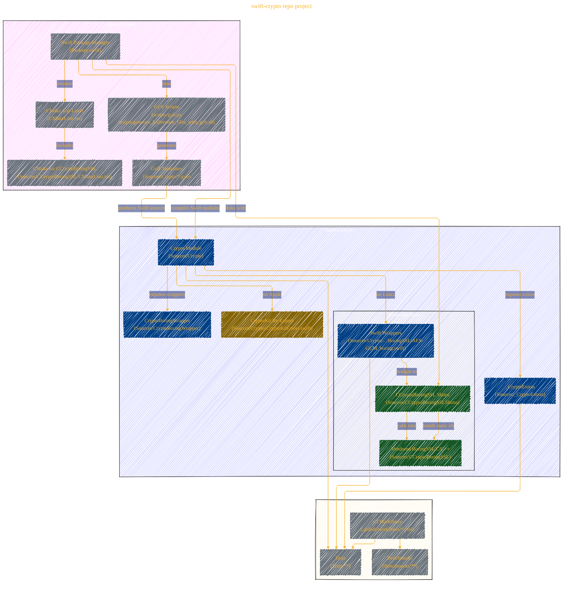
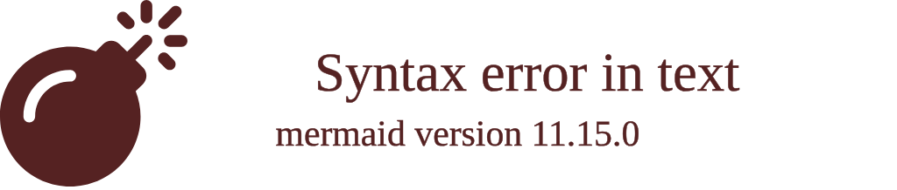

> ⚠️🏗️🚧🦺🧱🪵🪨🪚🛠️👷
> 
> This is an ongoing document collecting notes for personal educational purposes and references. 
> 
> 
> 
> gif image is provided by [Giphy](https://giphy.com)
> 
> ⚠️🏗️🚧🦺🧱🪵🪨🪚🛠️👷

----

# swift-crypto repo project

Click to show/hide the full disclaimer.

   
> <ins>📢 **Disclaimer** 🚨</ins>
>
> This document contains my personal notes on the topic,
> compiled from publicly available documentation and various cited sources.
> The materials are intended for 👨‍🎓 <ins>educational purposes</ins> 👨‍🎓 (<ins>:trollface:sometimes, entertainment purposes:trollface:</ins>), 📖 <ins> personal study </ins> 📖, and 🔖 <ins> technical reference </ins> 🔖.
> The content is dual-licensed:
> 1. **MIT License:** Applies to all code implementations (Swift, Mermaid, and other programming languages).
> 2. **Creative Commons Attribution-ShareAlike 4.0 International License (CC BY-SA 4.0):** Applies to all non-code content, including text, explanations, diagrams, and illustrations.

----

```mermaid
---
title: "swift-crypto repo project"
author: "Cong Le"
version: "1.0"
license(s): "MIT, CC BY-SA 4.0"
copyright: "Copyright © 2025 Cong Le. All Rights Reserved."
config:
  layout: elk
  theme: base
  look: handDrawn
---
%%%%%%%% Mermaid version v11.4.1-b.14
%%%%%%%% Available curve styles include the following keywords:
%% basis, bumpX, bumpY, cardinal, catmullRom, linear, monotoneX, monotoneY, natural, step, stepAfter, stepBefore.
%%{
  init: {
    'flowchart': { 'htmlLabels': true, 'curve': 'linear'},
    'fontFamily': 'Monaco',
    'themeVariables': {
      'primaryColor': '#22BB',
      'primaryTextColor': '#F8B229',
      'lineColor': '#F8B229',
      'primaryBorderColor': '#27AE60',
      'secondaryColor': '#3483',
      'secondaryTextColor': '#6C3483',
      'secondaryBorderColor': '#A569BD',
      'fontSize': '15px'
    }
  }
}%%
flowchart TB
    subgraph Build_System["Build System"]
    style Build_System fill:#F2F2,stroke:#333,stroke-width:1px, color: #FFFF
        SwiftPM["Swift Package Manager<br/>(Package.swift)"]:::tools
        CMakeTop["CMake Top-Level<br/>(CMakeLists.txt)"]:::tools
        CMakeSub["CMake for CCryptoBoringSSL<br/>(Sources/CCryptoBoringSSL/CMakeLists.txt)"]:::tools
        GyBTemplates["GyB Templates<br/>(Sources/Crypto/*.gyb)"]:::tools
        GyBScripts["GyB Scripts<br/>(scripts/gyb.py<br/>scripts/generate_boilerplate_files_with_gyb.sh)"]:::tools
    end

    subgraph Source_Layers["Source Layers"]
    style Source_Layers fill:#22F2,stroke:#333,stroke-width:1px, color: #FFFF
        PublicAPI["Crypto Module<br/>(Sources/Crypto)"]:::swift
        AppleBackend["CryptoKit Re-Export<br/>(Sources/Crypto/CryptoKitErrors.swift)"]:::external
        subgraph Linux_Backend["Linux Backend"]
        style Linux_Backend fill:#FFB2,stroke:#333,stroke-width:1px, color: #FFFF
            SwiftWrappers["Swift Wrappers<br/>(Sources/Crypto/.../BoringSSL/AES-GCM_boring.swift)"]:::swift
            CCryptoShims["CCryptoBoringSSL Shims<br/>(Sources/CCryptoBoringSSLShims)"]:::c
            VendoredBoringSSL["Vendored BoringSSL C/C++<br/>(Sources/CCryptoBoringSSL)"]:::c
        end
        CryptoBoringWrapper["CryptoBoringWrapper<br/>(Sources/CryptoBoringWrapper)"]:::swift
        CryptoExtras["_CryptoExtras<br/>(Sources/_CryptoExtras)"]:::swift
    end

    %% Tests & CI
    subgraph Quality_and_CI["Quality & CI"]
    style Quality_and_CI fill:#FB21,stroke:#333,stroke-width:1px, color: #FFFF
        Tests["Tests<br/>(Tests/**)"]:::tools
        Benchmarks["Benchmarks<br/>(Benchmarks/**)"]:::tools
        CI["CI Workflows<br/>(.github/workflows/*.yml)"]:::tools
    end

    %% Build-time Flow
    SwiftPM -->|"invokes"| CMakeTop
    CMakeTop -->|"includes"| CMakeSub
    SwiftPM -->|"runs"| GyBScripts
    GyBScripts -->|"generates"| GyBTemplates
    GyBTemplates -->|"produces Swift sources"| PublicAPI

    SwiftPM -->|"compiles Swift modules"| PublicAPI
    SwiftPM -->|"links with"| CCryptoShims
    CCryptoShims -->|"builds static lib"| VendoredBoringSSL

    %% Runtime Flow
    PublicAPI -->|"on Apple"| AppleBackend
    PublicAPI -->|"on Linux"| SwiftWrappers
    SwiftWrappers -->|"bridges to"| CCryptoShims
    CCryptoShims -->|"calls into"| VendoredBoringSSL
    PublicAPI -->|"exposes extras"| CryptoExtras
    PublicAPI -->|"exposes wrappers"| CryptoBoringWrapper

    %% Tests & CI connections
    PublicAPI --> Tests
    SwiftWrappers --> Tests
    CryptoExtras --> Tests
    CI --> Tests
    CI --> Benchmarks

    %% Click Events
    click PublicAPI "https://github.com/apple/swift-crypto/tree/main/Sources/Crypto"
    click AppleBackend "https://github.com/apple/swift-crypto/blob/main/Sources/Crypto/CryptoKitErrors.swift"
    click SwiftWrappers "https://github.com/apple/swift-crypto/blob/main/Sources/Crypto/AEADs/AES/GCM/BoringSSL/AES-GCM_boring.swift"
    click CCryptoShims "https://github.com/apple/swift-crypto/tree/main/Sources/CCryptoBoringSSLShims"
    click VendoredBoringSSL "https://github.com/apple/swift-crypto/tree/main/Sources/CCryptoBoringSSL"
    click CryptoBoringWrapper "https://github.com/apple/swift-crypto/tree/main/Sources/CryptoBoringWrapper"
    click CryptoExtras "https://github.com/apple/swift-crypto/tree/main/Sources/_CryptoExtras"
    click SwiftPM "https://github.com/apple/swift-crypto/blob/main/Package.swift"
    click CMakeTop "https://github.com/apple/swift-crypto/blob/main/CMakeLists.txt"
    click CMakeSub "https://github.com/apple/swift-crypto/blob/main/Sources/CCryptoBoringSSL/CMakeLists.txt"
    click GyBTemplates "https://github.com/apple/swift-crypto/blob/main/Sources/Crypto/AEADs/Nonces.swift.gyb"
    click GyBScripts "https://github.com/apple/swift-crypto/blob/main/scripts/generate_boilerplate_files_with_gyb.sh"
    click Tests "https://github.com/apple/swift-crypto/tree/main/Tests/CryptoTests/"
    click Benchmarks "https://github.com/apple/swift-crypto/blob/main/Benchmarks/Benchmarks/Benchmarks.swift"
    click CI "https://github.com/apple/swift-crypto/blob/main/.github/workflows/main.yml"

    %% Styles
    classDef swift fill:#004085,stroke:#004085
    classDef c fill:#155724,stroke:#155724
    classDef tools fill:#6c757d,stroke:#6c757d
    classDef external fill:#856404,stroke:#856404

```

----

<!-- 

```mermaid
%% Current Mermaid version
info
```  -->


```mermaid
---
title: "CongLeSolutionX"
author: "Cong Le"
version: "1.0"
license(s): "MIT, CC BY-SA 4.0"
copyright: "Copyright (c) 2025 Cong Le. All Rights Reserved."
config:
  theme: base
---
%%%%%%%% Mermaid version v11.4.1-b.14
%%{
  init: {
    'flowchart': { 'htmlLabels': false },
    'fontFamily': 'Bradley Hand',
    'themeVariables': {
      'primaryColor': '#fc82',
      'primaryTextColor': '#F8B229',
      'primaryBorderColor': '#27AE60',
      'secondaryColor': '#81c784',
      'secondaryTextColor': '#6C3483',
      'lineColor': '#F8B229',
      'fontSize': '20px'
    }
  }
}%%
flowchart LR
  My_Meme@{ img: "https://raw.githubusercontent.com/CongLeSolutionX/CongLeSolutionX/refs/heads/main/assets/images/My-meme-light-bulb-question-marks.png", label: "Ăn uống gì chưa ngừi đẹp?", pos: "b", w: 200, h: 150, constraint: "off" }

  Closing_quote@{ shape: braces, label: "...searching insights in the process of formulating better questions..." }

  Closing_quote ~~~ My_Meme
    
  Link_to_my_profile{{"<a href='https://github.com/CongLeSolutionX' target='_blank'>Click here if you care about my profile</a>"}}

  Closing_quote ~~~ My_Meme
  My_Meme animatingEdge@--> Link_to_my_profile
  
  animatingEdge@{ animate: true }

```

---
> **Licenses:**
>
> - **MIT License:**   - Full text in [LICENSE](LICENSE) file.
> - **Creative Commons Attribution 4.0 International:**  - Legal details in [LICENSE-CC-BY](LICENSE-CC-BY) and at [Creative Commons official site](http://creativecommons.org/licenses/by/4.0/).
> 
---
