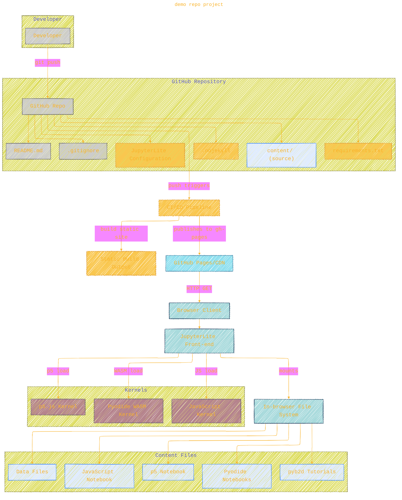

> ⚠️🏗️🚧🦺🧱🪵🪨🪚🛠️👷
> 
> This is a working draft in progress
> 
> 
>
> gif image is provided by [Giphy](https://giphy.com)
> 
> ⚠️🏗️🚧🦺🧱🪵🪨🪚🛠️👷

----

# demo repo project

Click to show/hide the full disclaimer.

   
> <ins>📢 **Disclaimer** 🚨</ins>
>
> This document contains my personal notes on the topic,
> compiled from publicly available documentation and various cited sources.
> The materials are intended for 👨‍🎓 <ins>educational purposes</ins> 👨‍🎓 (<ins>:trollface:sometimes, entertainment purposes:trollface:</ins>), 📖 <ins> personal study </ins> 📖, and 🔖 <ins> technical reference </ins> 🔖.
> The content is dual-licensed:
> 1. **MIT License:** Applies to all code implementations (Swift, Mermaid, and other programming languages).
> 2. **Creative Commons Attribution-ShareAlike 4.0 International License (CC BY-SA 4.0):** Applies to all non-code content, including text, explanations, diagrams, and illustrations.

---

```mermaid
---
title: "demo repo project"
author: "Cong Le"
version: "1.0"
license(s): "MIT, CC BY-SA 4.0"
copyright: "Copyright © 2025 Cong Le. All Rights Reserved."
config:
  layout: elk
  theme: base
  look: handDrawn
---
%%%%%%%% Mermaid version v11.4.1-b.14
%%%%%%%% Available curve styles include the following keywords:
%% basis, bumpX, bumpY, cardinal, catmullRom, linear, monotoneX, monotoneY, natural, step, stepAfter, stepBefore.
%%{
  init: {
    'flowchart': { 'htmlLabels': true, 'curve': 'basis' },
    'fontFamily': 'American Typewriter, monospace',
    'logLevel': 'fatal',
    'themeVariables': {
      'primaryColor': '#22BB',
      'primaryTextColor': '#F8B229',
      'lineColor': '#F8B229',
      'primaryBorderColor': '#27AE60',
      'secondaryColor': '#E2F1',
      'secondaryTextColor': '#6C3483',
      'secondaryBorderColor': '#A569BD',
      'fontSize': '20px'
    }
  }
}%%
flowchart TD
    subgraph "Developer"
        Dev["Developer"]:::external
    end

    subgraph "GitHub Repository"
        Repo["GitHub Repo"]:::external
        GI[".gitignore"]:::external
        RD["README.md"]:::external
        Config["JupyterLite Configuration"]:::cicd
        NoJ[".nojekyll"]:::cicd
        Req["requirements.txt"]:::cicd
        ContentSrc["content/ (source)"]:::content
        Dev -->|git push| Repo
        Repo --> GI
        Repo --> RD
        Repo --> Config
        Repo --> NoJ
        Repo --> Req
        Repo --> ContentSrc
        click GI "https://github.com/jupyterlite/demo/blob/main/.gitignore"
        click RD "https://github.com/jupyterlite/demo/blob/main/README.md"
        click Config "https://github.com/jupyterlite/demo/blob/main/repl/jupyter-lite.json"
        click NoJ "https://github.com/jupyterlite/demo/blob/main/.nojekyll"
        click Req "https://github.com/jupyterlite/demo/blob/main/requirements.txt"
        click ContentSrc "https://github.com/jupyterlite/demo/tree/main/content/"
    end

    Repo -->|push triggers| CI["CI/CD Pipeline"]:::cicd
    click CI "https://github.com/jupyterlite/demo/blob/main/.github/workflows/deploy.yml"
    CI -->|build static site| Build["Static Build Output"]:::cicd
    CI -->|publishes to gh-pages| CDN["GitHub Pages/CDN"]:::hosting

    CDN -->|HTTP GET| Browser["Browser Client"]:::client
    Browser --> FL["JupyterLite Front-end"]:::client

    FL -->|mounts| FS["In-browser File System"]:::client

    subgraph "Kernels"
        PK["Pyodide WASM Kernel"]:::kernel
        JK["JavaScript Kernel"]:::kernel
        P5["p5.js Kernel"]:::kernel
    end
    FL -->|WASM load| PK
    FL -->|JS load| JK
    FL -->|p5 load| P5

    subgraph "Content Files"
        JSDemo["JavaScript Notebook"]:::content
        P5Demo["p5 Notebook"]:::content
        DataF["Data Files"]:::content
        PyNB["Pyodide Notebooks"]:::content
        Py2D["pyb2d Tutorials"]:::content
        click JSDemo "https://github.com/jupyterlite/demo/blob/main/content/javascript.ipynb"
        click P5Demo "https://github.com/jupyterlite/demo/blob/main/content/p5.ipynb"
        click DataF "https://github.com/jupyterlite/demo/tree/main/content/data/"
        click PyNB "https://github.com/jupyterlite/demo/tree/main/content/pyodide/"
        click Py2D "https://github.com/jupyterlite/demo/tree/main/content/pyodide/pyb2d/"
    end
    FS --> JSDemo
    FS --> P5Demo
    FS --> DataF
    FS --> PyNB
    FS --> Py2D

    classDef external fill:#cccccc,stroke:#666,stroke-width:1px
    classDef cicd fill:#f9c74f,stroke:#e09f3e,stroke-width:1px
    classDef hosting fill:#90e0ef,stroke:#457b9d,stroke-width:1px
    classDef client fill:#a8dadc,stroke:#1d3557,stroke-width:1px
    classDef kernel fill:#b5838d,stroke:#6d6875,stroke-width:1px
    classDef content fill:#e0ecff,stroke:#3a86ff,stroke-width:1px

```

-----

<!-- 

```mermaid
%% Current Mermaid version
info
```  -->


```mermaid
---
title: "CongLeSolutionX"
author: "Cong Le"
version: "1.0"
license(s): "MIT, CC BY-SA 4.0"
copyright: "Copyright (c) 2025 Cong Le. All Rights Reserved."
config:
  theme: base
---
%%%%%%%% Mermaid version v11.4.1-b.14
%%{
  init: {
    'flowchart': { 'htmlLabels': false },
    'fontFamily': 'Bradley Hand',
    'themeVariables': {
      'primaryColor': '#fc82',
      'primaryTextColor': '#F8B229',
      'primaryBorderColor': '#27AE60',
      'secondaryColor': '#81c784',
      'secondaryTextColor': '#6C3483',
      'lineColor': '#F8B229',
      'fontSize': '20px'
    }
  }
}%%
flowchart LR
  My_Meme@{ img: "https://raw.githubusercontent.com/CongLeSolutionX/CongLeSolutionX/refs/heads/main/assets/images/My-meme-light-bulb-question-marks.png", label: "Ăn uống gì chưa ngừi đẹp?", pos: "b", w: 200, h: 150, constraint: "off" }

  Closing_quote@{ shape: braces, label: "...searching insights in the process of formulating better questions..." }
    

  Closing_quote ~~~ My_Meme
    
  Link_to_my_profile{{"<a href='https://github.com/CongLeSolutionX/CongLeSolutionX' target='_blank'>Click here if you care about my profile</a>"}}

  Closing_quote ~~~ My_Meme
  My_Meme animatingEdge@--> Link_to_my_profile
  
  animatingEdge@{ animate: true }


```

---
>**Licenses:**
>
>- **MIT License:**   - Full text in [LICENSE](LICENSE) file.
>- **Creative Commons Attribution-ShareAlike 4.0 International**: [CC BY-SA 4.0](https://creativecommons.org/licenses/by-sa/4.0/)  - Legal details in [LICENSE-CC-BY-SA-4.0](THE_PAST/LICENSE-CC-BY-SA-4.0) and at [Creative Commons official site](https://creativecommons.org/licenses/by-sa/4.0/).
>
---