```mermaid
%% Current Mermaid version
info
```  -->


```mermaid
---
title: "CongLeSolutionX"
author: "Cong Le"
version: "1.0"
license(s): "MIT, CC BY-SA 4.0"
copyright: "Copyright (c) 2025 Cong Le. All Rights Reserved."
config:
  theme: base
---
%%%%%%%% Mermaid version v11.4.1-b.14
%%{
  init: {
    'flowchart': { 'htmlLabels': false },
    'fontFamily': 'Bradley Hand',
    'themeVariables': {
      'primaryColor': '#fc82',
      'primaryTextColor': '#F8B229',
      'primaryBorderColor': '#27AE60',
      'secondaryColor': '#81c784',
      'secondaryTextColor': '#6C3483',
      'lineColor': '#F8B229',
      'fontSize': '20px'
    }
  }
}%%
flowchart LR
  My_Meme@{ img: "https://raw.githubusercontent.com/CongLeSolutionX/CongLeSolutionX/refs/heads/main/assets/images/My-meme-light-bulb-question-marks.png", label: "Ăn uống gì chưa ngừi đẹp?", pos: "b", w: 200, h: 150, constraint: "off" }

  Closing_quote@{ shape: braces, label: "...searching insights in the process of formulating better questions..." }
    
  My_Meme ~~~ Closing_quote
    
  Link_to_my_profile{{"<a href='https://github.com/CongLeSolutionX/CongLeSolutionX' target='_blank'>Click here if you care about my profile</a>"}}

  Closing_quote ~~~ My_Meme
  My_Meme animatingEdge@--> Link_to_my_profile
  
  animatingEdge@{ animate: true }



```

> ⚠️🏗️🚧🦺🧱🪵🪨🪚🛠️👷
> 
> This is a working draft in progress
> 
> 
>
> gif image is provided by [Giphy](https://giphy.com)
> 
> ⚠️🏗️🚧🦺🧱🪵🪨🪚🛠️👷


----


# GOAD repo project
<details open>
<summary>Click to show/hide the full disclaimer.</summary>
   
> <ins>📢 **Disclaimer** 🚨</ins>
>
> This document contains my personal notes on the topic,
> compiled from publicly available documentation and various cited sources.
> The materials are intended for 👨‍🎓 <ins>educational purposes</ins> 👨‍🎓 (<ins>:trollface:sometimes, entertainment purposes:trollface:</ins>), 📖 <ins> personal study </ins> 📖, and 🔖 <ins> reference </ins> 🔖.
> The content is dual-licensed:
> 1. **MIT License:** Applies to all code implementations (Swift, Mermaid, and other programming languages).
> 2. **Creative Commons Attribution-ShareAlike 4.0 International License (CC BY-SA 4.0):** Applies to all non-code content, including text, explanations, diagrams, and illustrations.

</details>


----

```mermaid
---
title: "GOAD repo project"
author: "Cong Le"
version: "1.0"
license(s): "MIT, CC BY-SA 4.0"
copyright: "Copyright (c) 2025 Cong Le. All Rights Reserved."
config:
  layout: elk
  theme: base
  look: handDrawn
---
%%%%%%%% Mermaid version v11.4.1-b.14
%%%%%%%% Available curve styles include the following keywords:
%% basis, bumpX, bumpY, cardinal, catmullRom, linear, monotoneX, monotoneY, natural, step, stepAfter, stepBefore.
%%{
  init: {
    'flowchart': { 'htmlLabels': true, 'curve': 'basis' },
    'fontFamily': 'American Typewriter, monospace',
    'logLevel': 'fatal',
    'themeVariables': {
      'primaryColor': '#22BB',
      'primaryTextColor': '#F8B229',
      'lineColor': '#F8B229',
      'primaryBorderColor': '#27AE60',
      'secondaryColor': '#E2F1',
      'secondaryTextColor': '#6C3483',
      'secondaryBorderColor': '#A569BD',
      'fontSize': '20px'
    }
  }
}%%
flowchart TD
    %% Global Entities

    U@{ img: "https://raw.githubusercontent.com/CongLeSolutionX/CongLeSolutionX/refs/heads/main/assets/images/My-meme-questions-magnifying-glass-tangled-lines-bubble-thought.png", label: "User Command", pos: "b", w: 200, h: 150, constraint: "on" }

    U:::orchestration

    subgraph Orchestrator_Provisioning_Engine["Orchestrator/Provisioning Engine"]
    style Orchestrator_Provisioning_Engine fill:#F2F2,stroke:#333,stroke-width:1px, color: #FFFF
        OPY["<b>goad.py</b> <br/>(CLI)"]:::orchestration
        OMOD["<b>goad/</b> <br/>(Modules)"]:::orchestration
    end

    %% Lab Environment Variants
    LV["Lab Variants <br/>(<b>ad/</b>)"]:::lab

    %% Infrastructure Providers
    PR["Providers <br/>(<b>goad/provider</b>)"]:::provider

    %% Automation/Configuration Management
    ANS["Ansible Provisioning <br/>(<b>ansible/</b>)"]:::automation

    %% Virtual Machine Image Builders
    PACK["VM Image Builder <br/>(<b>packer/</b>)"]:::vm
    VAGR["VM Manager <br/>(<b>vagrant/</b>)"]:::vm

    %% Extensions
    EXT["Extensions <br/>(<b>extensions/</b>)"]:::extension

    %% Documentation and Templates
    DOC["Documentation<br/>(<b>docs/</b>)"]:::docs
    TEMP["Templates<br/>(<b>template/</b>)"]:::docs

    %% Connections
    U -->|"invokes"| OPY
    OPY -->|"loads modules"| OMOD
    OMOD -->|"parses config"| LV
    OMOD -->|"calls provider logic"| PR
    PR -->|"applies Packer/Terraform"| PACK
    PR -->|"applies Vagrant config"| VAGR
    PR -->|"deploys VMs"| LV
    OMOD -->|"triggers Ansible"| ANS
    LV -->|"loads extensions"| EXT
    LV -->|"references docs"| DOC
    LV -->|"references templates"| TEMP

    %% Click Events
    click OPY "https://github.com/orange-cyberdefense/goad/blob/main/goad.py"
    click OMOD "https://github.com/orange-cyberdefense/goad/tree/main/goad/"
    click PR "https://github.com/orange-cyberdefense/goad/tree/main/goad/provider/"
    click ANS "https://github.com/orange-cyberdefense/goad/tree/main/ansible/"
    click PACK "https://github.com/orange-cyberdefense/goad/tree/main/packer/"
    click VAGR "https://github.com/orange-cyberdefense/goad/tree/main/vagrant/"
    click LV "https://github.com/orange-cyberdefense/goad/tree/main/ad/"
    click EXT "https://github.com/orange-cyberdefense/goad/tree/main/extensions/"
    click DOC "https://github.com/orange-cyberdefense/goad/tree/main/docs/"
    click TEMP "https://github.com/orange-cyberdefense/goad/tree/main/template/"

    %% Styles
    classDef orchestration fill:#FF211,stroke:#000,stroke-width:2px;
    classDef lab fill:#BEB2,stroke:#000,stroke-width:2px;
    classDef provider fill:#C6C9,stroke:#000,stroke-width:2px;
    classDef automation fill:#FEC3,stroke:#000,stroke-width:2px;
    classDef vm fill:#BBF2,stroke:#000,stroke-width:2px;
    classDef extension fill:#FCD2,stroke:#000,stroke-width:2px;
    classDef docs fill:#EE22,stroke:#000,stroke-width:2px;
```

----


<!-- 


---
>**Licenses:**
>
>- **MIT License:**  [](LICENSE) - Full text in [LICENSE](LICENSE) file.
>- **Creative Commons Attribution-ShareAlike 4.0 International**: [CC BY-SA 4.0](https://creativecommons.org/licenses/by-sa/4.0/) [](https://creativecommons.org/licenses/by-sa/4.0/) - Legal details in [LICENSE-CC-BY-SA-4.0](THE_PAST/LICENSE-CC-BY-SA-4.0) and at [Creative Commons official site](https://creativecommons.org/licenses/by-sa/4.0/).
>
---
