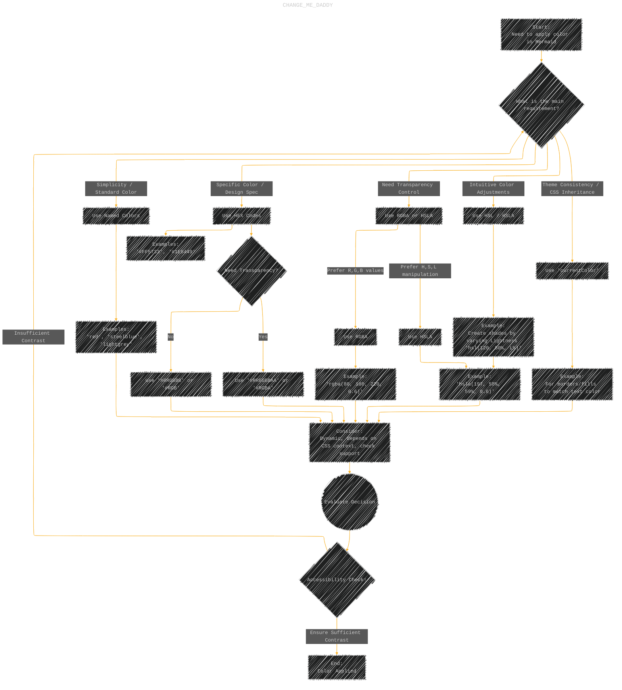
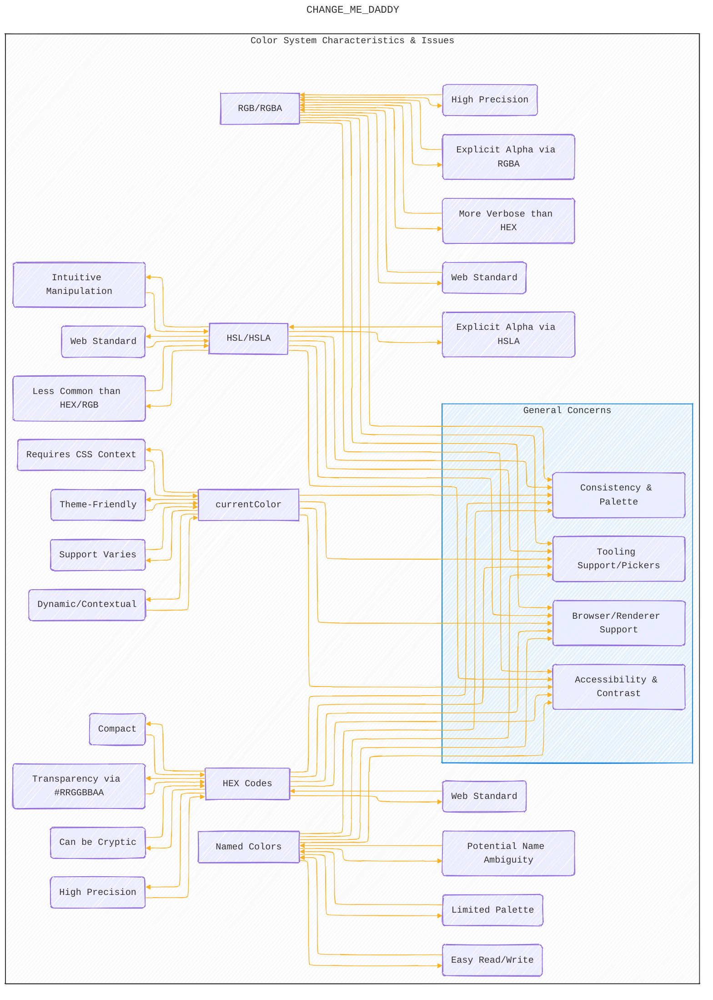

> ⚠️🏗️🚧🦺🧱🪵🪨🪚🛠️👷
> 
> This is an ongoing document collecting notes for personal educational purposes and references. 
> 
> 
> 
> gif image is provided by [Giphy](https://giphy.com)
> 
> ⚠️🏗️🚧🦺🧱🪵🪨🪚🛠️👷

----


# Comprehensive Color Code System Guide for Mermaid Diagrams
> **Disclaimer:**
>
> This document contains my personal notes on the topic,
> compiled from publicly available documentation and various cited sources.
> The materials are intended for educational purposes, personal study, and reference.
> The content is dual-licensed:
> 1. **MIT License:** Applies to all code implementations (Swift, Mermaid, and other programming languages).
> 2. **Creative Commons Attribution 4.0 International License (CC BY 4.0):** Applies to all non-code content, including text, explanations, diagrams, and illustrations.
---


## A Diagrammatic Guide 

This guide explores the various color code systems supported or potentially usable within Mermaid diagrams, detailing their syntax, use cases, advantages, and potential issues. Effective color use enhances readability and visual communication in diagrams.

### 1. Color System Overview

This mind map categorizes the common color definition methods usable in Mermaid, which generally relies on standard CSS color formats for rendering (primarily in SVG).

```mermaid
---
title: "CHANGE_ME_DADDY"
author: "Cong Le"
version: "1.0"
license(s): "MIT, CC BY 4.0"
copyright: "Copyright (c) 2025 Cong Le. All Rights Reserved."
config:
  layout: elk
  look: handDrawn
  theme: dark
---
%%%%%%%% Mermaid version v11.4.1-b.14
%%%%%%%% Toggle theme value to `base` to activate the initilization below for the customized theme version.
%%%%%%%% Available curve styles include the following keywords:
%% basis, bumpX, bumpY, cardinal, catmullRom, linear, monotoneX, monotoneY, natural, step, stepAfter, stepBefore.
%%{
  init: {
    'flowchart': {'htmlLabels': false, 'curve': 'basis' },
    'fontFamily': 'monospace',
    'themeVariables': {
      'lineColor': '#F8B229'
    }
  }
}%%
mindmap
  root((Color Code Systems for Mermaid))
    Named_Colors["Named Colors<br>(CSS/HTML)"]
      ::icon(fa fa-palette)
      Description["Description:<br>Predefined color names<br>(e.g., 'red', 'blue', 'lightgray')"]
      Syntax["Syntax:<br>'colorName'"]
      Pros:
        Pros_1["Easy to read and write"]
        Pros_2["Good for standard colors"]
      Cons:
        Cons_1["Limited palette<br>(~140 standard names)"]
        Cons_2["Can be ambiguous<br>(e.g., 'grey' vs 'gray')"]
      Examples["Examples:<br>'red', 'lightblue', 'darkgreen', 'transparent'"]
    Hexadecimal["Hexadecimal<br>(HEX)"]
      ::icon(fa fa-hashtag)
      Description["Description:<br>- Uses hexadecimal values for Red, Green, Blue (RGB) components.<br>- Optional Alpha (Transparency)"]
      Syntax:
        Syntax_1["'#RGB'<br>(Shorthand, e.g., '#F00' for red)"]
        Syntax_2["'#RRGGBB'<br>(Full, e.g., '#FF0000' for red)"]
        Syntax_3["'#RGBA'<br>(Shorthand with Alpha, e.g., '#F008' for 53% transparent red)"]
        Syntax_4["'#RRGGBBAA'<br>(Full with Alpha, e.g., '#FF000088' for ~53% transparent red)"]
      Pros:
        Pros_1["Very precise<br>(16.7 million+ colors without alpha)"]
        Pros_2["Widely used and understood in web development"]
        Pros_3["Compact representation"]
      Cons:
        Cons_1["Less intuitive than names"]
        Cons_2["Alpha syntax ('#RRGGBBAA') is less common/supported than RGBA/HSLA in some older tools (but standard now)"]
      Examples["Examples:<br> '#FF5733', '#33FF57', '#3357FF', '#FFFFFF', '#00000080' (50% black)"]
    RGB / RGBA
      ::icon(fa fa-paint-brush)
      Description["Description:<br>- Defines colors using Red, Green, Blue values (0-255).<br>- RGBA adds an Alpha channel (0.0-1.0)."]
      Syntax:
        Syntax_1["'rgb(R, G, B)'<br>(e.g., 'rgb(255, 0, 0)')"]
        Syntax_2["'rgba(R, G, B, A)'<br>(e.g., 'rgba(0, 0, 255, 0.5)')"]
      Pros:
        Pros_1["Precise, explicit values"]
        Pros_2["Standard way to specify transparency (RGBA)"]
        Pros_3["Commonly used in design tools"]
      Cons["More verbose than HEX"]
      Examples["Examples:<br> 'rgb(100, 150, 200)', 'rgba(255, 87, 51, 0.75)'"]
    HSL_HSLA["HSL / HSLA"]
      ::icon(fa fa-adjust)
      Description["Description:<br>- Defines colors using Hue (0-360), Saturation (0-100%), Lightness (0-100%).<br>- HSLA adds Alpha (0.0-1.0)."]
      Syntax:
        Syntax_1["'hsl(H, S%, L%)'<br>(e.g., 'hsl(120, 100%, 50%)' for pure green)"]
        Syntax_2["'hsla(H, S%, L%, A)'<br>(e.g., 'hsla(240, 100%, 50%, 0.3)')"]
      Pros:
        Pros_1["More intuitive for color manipulation<br>(adjusting hue, saturation, lightness)"]
        Pros_2["Easy to create palettes<br>(e.g., vary lightness for shades)"]
        Pros_3["Standard way to specify transparency<br>(HSLA)"]
      Cons["Less common than HEX/RGB in some contexts"]
      Examples["Examples:<br> 'hsl(0, 100%, 50%)' (red),<br> 'hsl(200, 50%, 70%)',<br> 'hsla(300, 75%, 60%, 0.8)'"]
    currentColor_Keyword["'currentColor' Keyword"]
      ::icon(fa fa-sync-alt)
      Description["Description:<br>A CSS keyword representing the value of the CSS 'color' property on the element"]
      Syntax["Syntax:<br>'currentColor'"]
      Pros:
        Pros_1["Excellent for theming<br>(inherits text color)"]
        Pros_2["Ensures consistency between text and associated graphical elements<br>(like borders, fills)"]
      Cons:
        Cons_1["Behavior depends entirely on the surrounding CSS context where Mermaid is rendered"]
        Cons_2["May not be explicitly supported in all Mermaid directives<br>(test needed)"]
        
```


**Technical Notes on Mind Map:**

*   **CSS Standard:** Mermaid generally leverages standard CSS color formats for SVG rendering. Browser compatibility for these core formats (Named, HEX, RGB(A), HSL(A)) is excellent in modern browsers.
*   **Transparency:** Use RGBA, HSLA, or HEX with Alpha (`#RRGGBBAA`) for transparency effects. `transparent` is a named color equivalent to `rgba(0,0,0,0)`.
*   **`currentColor` Context:** The usefulness of `currentColor` depends heavily on *how* Mermaid is integrated. If it's within a web page styled with CSS, it can inherit that styling. In simpler renderers, its behavior might be undefined or default to black/white.

---

### 2. Choosing a Color System

This flowchart helps decide which color system to use based on needs:



**Technical Notes on Flowchart:**

*   **HEX vs. RGBA/HSLA for Transparency:** While `#RRGGBBAA` is standard CSS, `rgba()` and `hsla()` have historically been the more common and sometimes better-supported methods for explicit transparency across various tools and older browsers. For modern usage, any should work, but `rgba/hsla` might be slightly more explicit/readable regarding the alpha channel.
*   **Accessibility is Crucial:** Always check the contrast ratio between text color and background color, and between adjacent filled areas, to ensure readability for users with visual impairments (WCAG guidelines). Use online contrast checkers.
*   **Consistency:** Choose a system (or a limited set of systems) and stick to it within a project for maintainability. Define a palette using variables if using Mermaid via API or themes.

---

### 3. Color System Characteristics & Potential Issues

This graph compares the systems based on key characteristics and highlights potential pitfalls:




**Technical Notes on Characteristics & Issues:**

*   **Precision vs. Readability:** Named colors are readable but not precise. HEX, RGB, HSL offer precision, with HEX being the most compact but arguably least human-readable.
*   **Transparency:** RGBA and HSLA are the most explicit ways. HEX with alpha (`#RRGGBBAA`) works but is less visually clear about the alpha component.
*   **Tooling:** Most modern design tools and color pickers support HEX, RGB(A), and HSL(A). Named colors are basic. `currentColor` is a code concept, not usually found in visual pickers.
*   **Maintenance:** Using a consistent system (like HEX for all final colors) and defining a palette (e.g., using CSS variables if possible, or just documenting choices) makes maintenance easier. Avoid mixing systems haphazardly.
*   **Mermaid Context:** Remember that Mermaid generates SVG (usually). The SVG viewer (typically a web browser) interprets these standard CSS color values. Support for all these formats is widespread in any reasonably modern browser. `currentColor`'s behavior remains the most context-dependent aspect.

---

### Summary and Best Practices

*   **Default Choice:** For general use requiring specific colors, **HEX (`#RRGGBB`)** is often the most practical due to its precision, compactness, and widespread support in tooling.
*   **Transparency Needed:** Use **RGBA** or **HSLA** for clear, explicit alpha control, or **`#RRGGBBAA`** if HEX is preferred.
*   **Simplicity:** Use **Named Colors** for quick, standard colors where exact shades aren't critical.
*   **Color Manipulation/Palettes:** **HSL/HSLA** is excellent for programmatically generating related colors (e.g., changing lightness for hover states, hue for different categories).
*   **Theming:** Use **`currentColor`** strategically when you want elements to inherit the surrounding text color, ensuring consistency within a themed environment (requires testing).
*   **Accessibility First:** **Always** check color contrast ratios. This is non-negotiable for creating usable diagrams. Tools like WebAIM's Contrast Checker are essential.
*   **Consistency:** Define and reuse a limited color palette within your diagrams or project to maintain a professional and coherent look. Document your choices.
*   **Test:** Verify colors render correctly and legibly in your target viewing environment(s).


---
**Licenses:**

- **MIT License:**  [](LICENSE) - Full text in [LICENSE](LICENSE) file.
- **Creative Commons Attribution 4.0 International:** [](LICENSE-CC-BY) - Legal details in [LICENSE-CC-BY](LICENSE-CC-BY) and at [Creative Commons official site](http://creativecommons.org/licenses/by/4.0/).

---
