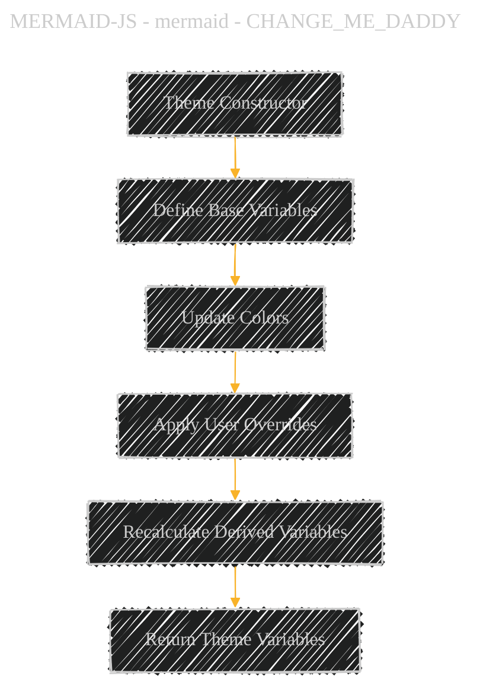
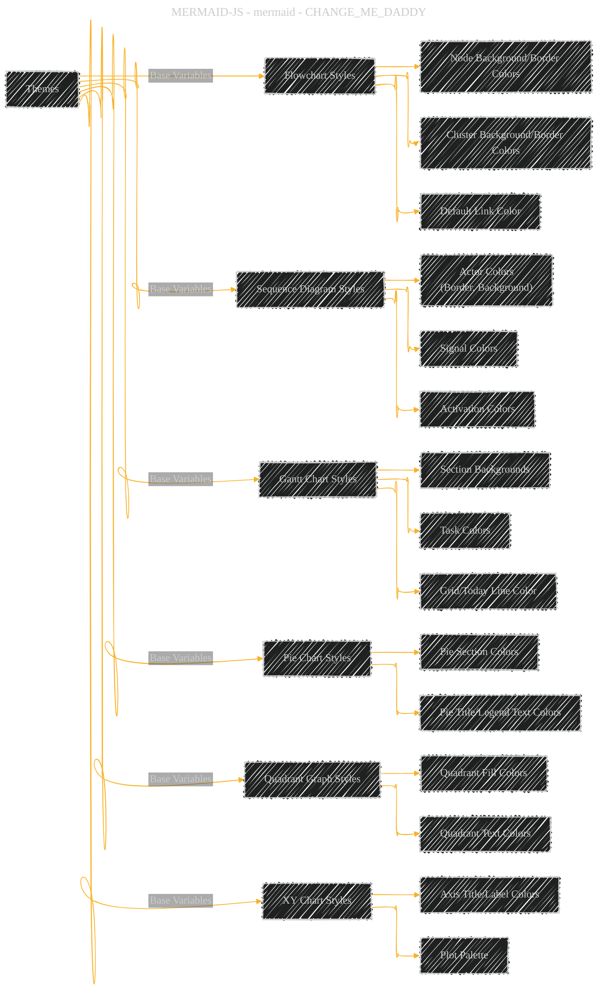
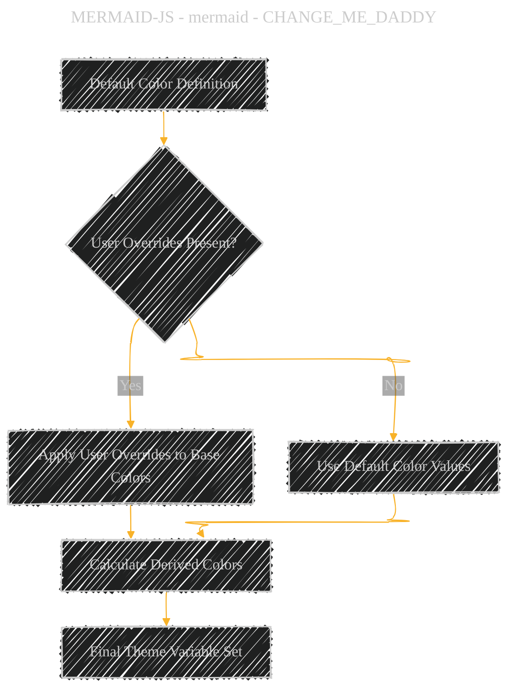
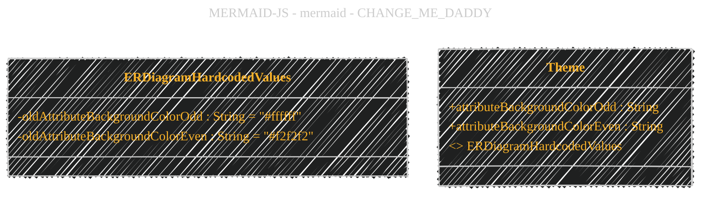

# JavaScript theme module comprehensive overview
> **Disclaimer:**
>
> This document contains my personal notes on the topic,
> compiled from publicly available documentation and various cited sources.
> The materials are intended for educational purposes, personal study, and reference.
> The content is dual-licensed:
> 1. **MIT License:** Applies to all code implementations (Swift, Mermaid, and other programming languages).
> 2. **Creative Commons Attribution 4.0 International License (CC BY 4.0):** Applies to all non-code content, including text, explanations, diagrams, and illustrations.
---

## A Diagrammatic Guide 

Here is a strategic analysis and series of Mermaid syntax diagrams representing the core technical complexity of the provided code implementation.

---

### 1. Overall Theme Architecture
The `themes` package defines multiple theme configurations (e.g., `dark`, `default`, `forest`, `neutral`, etc.) using shared and independent variables. The following diagram outlines the relationship between theme files and their dependencies.

---

### 2. Theme Variable Lifecycle
Each theme uses a `Theme` class with its own lifecycle of defining, updating, and calculating variables. The following flowchart represents this process.

---

### 3. Thematic Styling Components
Each theme defines multiple categories of styling variables. The following diagram outlines the high-level breakdown.

---

### 4. Shared Utilities
The `theme-helpers.js` file provides reusable utility functions to manipulate colors, such as adjusting brightness or saturation.

---

### 5. Dark Mode Conditional Logic
Each theme supports a `darkMode` flag that dynamically adjusts colors based on brightness. The following sequence diagram shows how dark mode adjustments are applied.

---

### 6. Integration Across Diagram Types
Themes define specific variables for various diagram types (e.g., flowchart, sequence diagram, Gantt chart). The following flowchart represents how each theme integrates with these diagram types.

---

### 7. Dynamic Color Adjustments
Themes dynamically calculate colors based on user overrides or default values. The following diagram shows the conditional logic.

---

### 8. Themes and Hardcoded Values
Some themes depend on hardcoded values from `erDiagram-oldHardcodedValues.js`. These values are integrated into entity-relationship diagram styles.

---

### 9. Theme-Specific Variations
Each theme (`dark`, `default`, `forest`, `neutral`) customizes specific variables while maintaining shared logic. Below is a comparison of theme-specific features.

---

### Summary of the Analysis:
The provided implementation demonstrates an advanced modular architecture for managing themes in `Mermaid`. It allows for:
1. Dynamic configuration of base and derived variables.
2. Shared logic for efficient reuse across multiple themes.
3. Integration of diagram-specific styles while maintaining consistency.
4. Conditional support for dark mode adjustments.
5. Extensibility for future themes or styles.

---
**Licenses:**

- **MIT License:**   - Full text in [LICENSE](LICENSE) file.
- **Creative Commons Attribution 4.0 International:**  - Legal details in [LICENSE-CC-BY](LICENSE-CC-BY) and at [Creative Commons official site](http://creativecommons.org/licenses/by/4.0/).

---