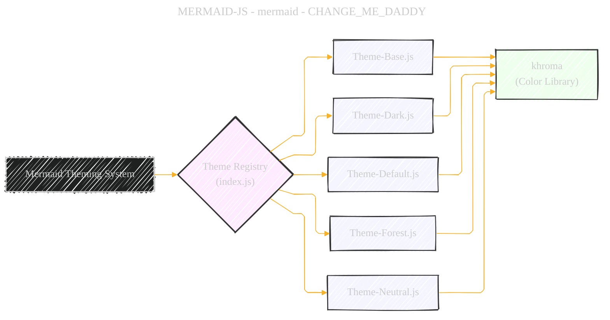
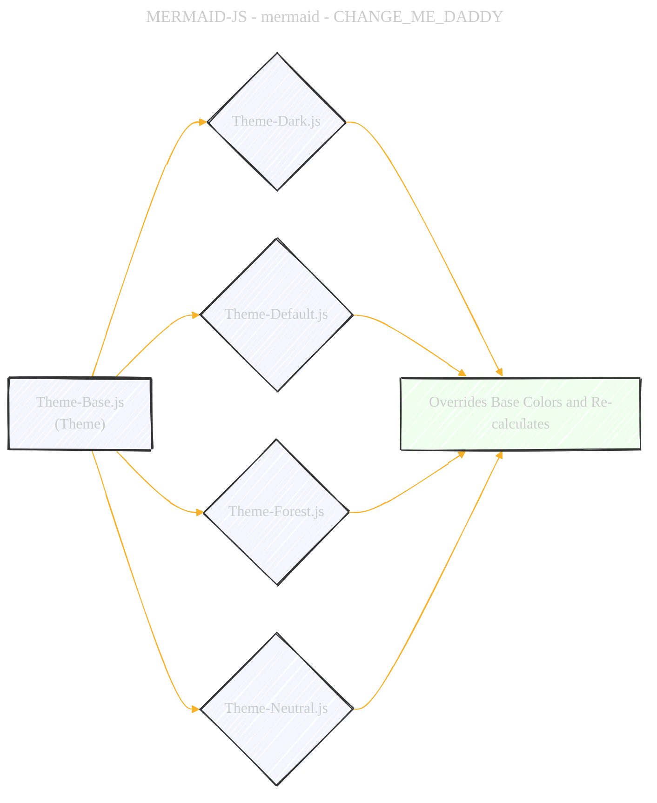

> ⚠️🏗️🚧🦺🧱🪵🪨🪚🛠️👷
> 
> This is an ongoing document collecting notes for personal educational purposes and references. 
> 
> 
> 
> gif image is provided by [Giphy](https://giphy.com)
> 
> ⚠️🏗️🚧🦺🧱🪵🪨🪚🛠️👷

----

# JavaScript theme module comprehensive overview
> **Disclaimer:**
>
> This document contains my personal notes on the topic,
> compiled from publicly available documentation and various cited sources.
> The materials are intended for educational purposes, personal study, and reference.
> The content is dual-licensed:
> 1. **MIT License:** Applies to all code implementations (Swift, Mermaid, and other programming languages).
> 2. **Creative Commons Attribution 4.0 International License (CC BY 4.0):** Applies to all non-code content, including text, explanations, diagrams, and illustrations.
---

## 1. Overall Structure: Theme Management

**Explanation:**

*   **`A[Mermaid Theming System]`**: Represents the top-level system.
*   **`B{Theme Registry (index.js)}`**:  This acts as the central point, managing and providing access to different themes.
*   **`C[Theme-Base.js]`**, **`D[Theme-Dark.js]`**, etc.: These are individual theme files, each defining a set of color variables and related styles for a specific theme (base, dark, default, forest, neutral).
*   **`H[khroma (Color Library)]`**:  A dependency used for color manipulation (adjusting hue, saturation, lightness, inverting colors, etc.).  All themes utilize `khroma` for color calculations.

## 2. Theme Base Class and Color Calculation (`theme-base.js`)

**Explanation:**

*   **`Theme` Class:**
    *   Contains numerous color variables (e.g., `background`, `primaryColor`, `textColor`, `nodeBkg`, etc.).
    *   `constructor()`: Initializes default color values.
    *   `updateColors()`:  **Crucial Method:** Calculates derived color values (e.g., `primaryTextColor`, `secondaryColor`, etc.) based on the base colors and the `khroma` library.  It's responsible for setting up the color scheme based on the chosen base colors.
    *   `calculate(overrides: object)`:  Handles theme customization by allowing user-provided overrides for specific colors. It merges the overrides, calls `updateColors()` to recalculate the color scheme, and applies any overrides to derived values.
*   **`ThemeHelper` Class:**
    *   `mkBorder(col: string, darkMode: boolean) : string`: Function to generate border colors based on input color and dark mode flag.
*   **`khroma`:** External library used by `Theme` to perform various color manipulations, including:
    *   `adjust()`: Modifies color properties like hue, saturation, and lightness.
    *   `darken()`: Darkens a color.
    *   `lighten()`: Lightens a color.
    *   `invert()`: Inverts a color.

## 3. Theme Inheritance and Customization:

**Explanation:**

*   **`A[Theme-Base.js (Theme)]`**: Defines the base theme class.
*   **`B{Theme-Dark.js}`**, **`C{Theme-Default.js}`**, etc.: Each theme file extends the `Theme` class or creates a new instance. They provide specific color values, often overriding base theme colors.
*   **`F[Overrides Base Colors and Re-calculates]`**: The core logic is that each theme:
    *   Sets its own values for base colors.
    *   Calls `calculate(overrides)` (from the `Theme` class) to ensure derived colors are correctly calculated based on the overridden base colors and any user provided overrides.

## 4. Theme Variable Calculation Flow (Illustrative):

**Explanation:**

*   This sequence diagram illustrates the process of theme calculation and customization:
    *   The `Theme` class is instantiated.
    *   User-provided overrides (if any) are applied.
    *   `updateColors()` is called to calculate the derived color values using the `khroma` library.  Example calculations are shown (adjusting the `primaryColor`, inverting the `background`).
    *   The function returns the `theme` object.

## 5. `erDiagram-oldHardcodedValues.ts` and Its Role

**Explanation:**

*   **`A[Mermaid Core]`**:  The main Mermaid library code.
*   **`B{erDiagram-oldHardcodedValues.ts}`**: This file contains hardcoded color values for the ER (Entity Relationship) diagram.
*   **`C[Theme System]`**:  The theming system.
*   **`D[Theme-Base.js]`**: This file is the base of the theme system.
*   **`E[Theme-*.js files]`**: The individual theme files, inherit colors from `Theme-Base.js`.

*   **Role:** It holds old, hardcoded values that were previously directly in the ER diagram's styling code (`src/diagrams/er/styles.js`). The file acts as a bridge to maintain visual consistency while the theming system is refactored.  The ER diagram's styling now *references* these values.

## 6.  Key Takeaways and Potential Improvements

*   **Modular Design:** The separation of concerns (theme registry, base theme, individual themes, color manipulation library) promotes maintainability and extensibility.
*   **Color Calculation:**  The use of `khroma` and the `updateColors()` method centralize the color logic, making it easy to change how colors are derived.
*   **Customization:** The `calculate()` method allows users to override theme colors, providing flexibility.
*   **`erDiagram-oldHardcodedValues.ts`**:  A temporary solution.  Ideally, these hardcoded values should be integrated fully into the theme system for better consistency and maintainability.

**Potential Improvements:**

*   **More Fine-Grained Control:** Allow for overriding individual color properties within a diagram type (e.g., control the color of a specific element within a flowchart).
*   **Theme Inheritance:** Explore more sophisticated inheritance models to reduce code duplication.
*   **Dynamic Color Adjustments:** Allow for dynamic color adjustments based on the user's system theme (light/dark mode).
*   **Testing:**  Implement comprehensive unit tests to ensure the theme system's correctness and stability.
*   **Documentation:**  Improve documentation to clearly explain how to create and customize themes.

---

<!-- 

---
> **Licenses:**
>
> - **MIT License:**   - Full text in [LICENSE](LICENSE) file.
> - **Creative Commons Attribution 4.0 International:**  - Legal details in [LICENSE-CC-BY](LICENSE-CC-BY) and at [Creative Commons official site](http://creativecommons.org/licenses/by/4.0/).
> 
---
