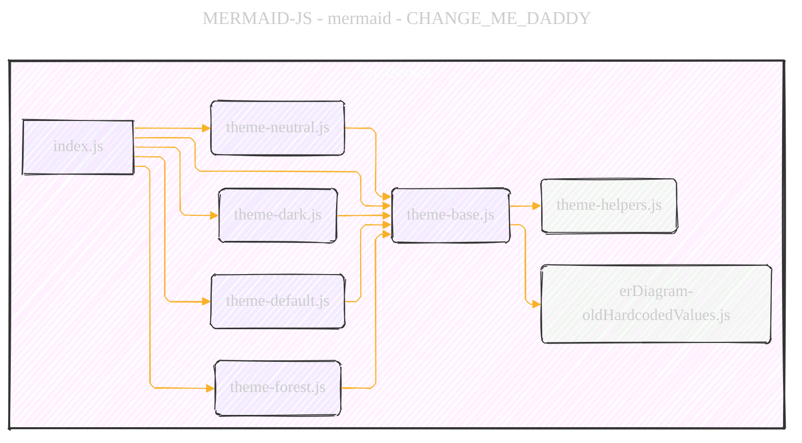
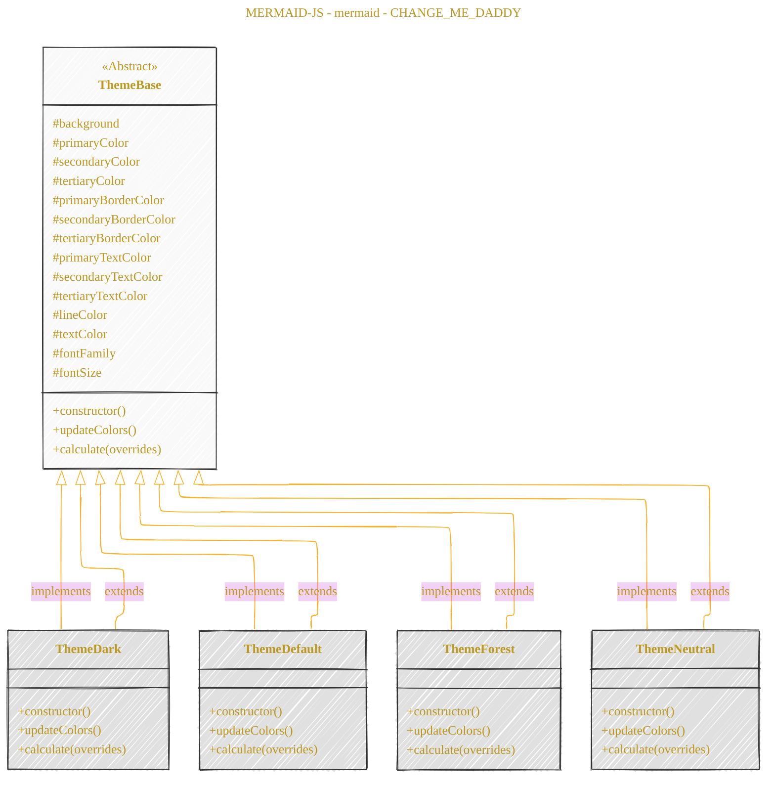

> ⚠️🏗️🚧🦺🧱🪵🪨🪚🛠️👷
> 
> This is an ongoing document collecting notes for personal educational purposes and references. 
> 
> 
> 
> gif image is provided by [Giphy](https://giphy.com)
> 
> ⚠️🏗️🚧🦺🧱🪵🪨🪚🛠️👷

----

# JavaScript theme module comprehensive overview
> **Disclaimer:**
>
> This document contains my personal notes on the topic,
> compiled from publicly available documentation and various cited sources.
> The materials are intended for educational purposes, personal study, and reference.
> The content is dual-licensed:
> 1. **MIT License:** Applies to all code implementations (Swift, Mermaid, and other programming languages).
> 2. **Creative Commons Attribution 4.0 International License (CC BY 4.0):** Applies to all non-code content, including text, explanations, diagrams, and illustrations.
---

## A Diagrammatic Guide 

### Overview

1.  **Module Structure and Dependencies**: How the different files and modules relate to each other.
2.  **Class Hierarchy and Inheritance**: The class structure of the `Theme` classes in different files and how they inherit from each other.
3.  **Theme Variable Calculation Flow**: The process of how theme variables are calculated and updated, especially focusing on the `calculate` and `updateColors` methods.
4.  **Color Palette and Overrides**: How colors are defined, adjusted, and overridden in different themes.

Here are the Mermaid diagrams I will create:

**Diagram 1: Module Dependency Diagram** - using `flowchart` to show the files and their dependencies.

**Diagram 2: Class Inheritance Diagram** - using `classDiagram` to illustrate the inheritance structure of the `Theme` classes.

**Diagram 3: Theme Calculation Flowchart** - using `flowchart` to visualize the `calculate` and `updateColors` methods in the `Theme` class, focusing on the logic of variable assignment and color adjustments.

**Diagram 4: Color Palette Generation Overview** - using a `mindmap` to broadly categorize how color palettes are generated and managed within the theming system.

Let's begin creating these diagrams using Mermaid syntax.

---

### Module Dependency Diagram

**Explanation**

*   **Type**: Flowchart Diagram (`flowchart LR`)
*   **Purpose**: Illustrates the modular structure and dependencies within the `src/themes` directory.
*   **Nodes**: Each Javascript file is represented as a node (e.g., `index.js`, `theme-base.js`).
*   **Subgraphs**:  The `themes` subgraph visually groups all the theme-related files.
*   **Arrows**: Arrows indicate import/dependency relationships. For example, `index.js` imports from all `theme-*.js` files, and `theme-base.js` imports from `theme-helpers.js` and `erDiagram-oldHardcodedValues.js`.
*   **Styling**: Different fill colors are used to visually group and distinguish core theme files from helper files.

---

### Class Inheritance Diagram

**Explanation**

*   **Type**: Class Diagram (`classDiagram`)
*   **Purpose**: Depicts the class hierarchy, specifically the inheritance relationship between the `Theme` classes.
*   **Classes**: Each theme (`ThemeBase`, `ThemeDark`, `ThemeDefault`, `ThemeForest`, `ThemeNeutral`) is represented as a class box.
*   **Abstract Class**: `ThemeBase` is marked as `<<Abstract>>` to indicate it's intended as a base class.
*   **Attributes**: Key protected (#) and public (+) attributes and methods (`constructor`, `updateColors`, `calculate`) are listed within each class box, summarizing the main members.
*   **Inheritance Arrows**:  `--|>` arrows show inheritance, indicating that `ThemeDark`, `ThemeDefault`, `ThemeForest`, and `ThemeNeutral` all extend `ThemeBase`.
*   **Implementation Arrows**: `<|--` arrows also reinforces the implementation aspect - derived themes are implementations of the base theme's structure.
*   **Styling**: Different fill colors are used for the base class and derived classes for visual hierarchy.

---

### Theme Calculation Flowchart

```mermaid
---
title: "MERMAID-JS - mermaid - CHANGE_ME_DADDY"
config:
  layout: elk
  look: handDrawn
  theme: dark
---
%%%%%%%% Mermaid version v11.4.1-b.14
%%%%%%%% Available curve styles include the following keywords:
%% basis, bumpX, bumpY, cardinal, catmullRom, linear, monotoneX, monotoneY, natural, step, stepAfter, stepBefore.
%%{
  init: {
    "flowchart": { "htmlLabels": false },
    'fontFamily': 'Fantasy',
    'themeVariables': {
      'primaryColor': '#B2C3',
      'primaryTextColor': '#B92',
      'primaryBorderColor': '#7c2',
      'lineColor': '#F8B229'
    }
  }
}%%
flowchart LR
    subgraph Theme_Class_calculate_overrides["Theme Class - calculate(overrides)"]
    style Theme_Class_calculate_overrides fill:#c222,stroke:#333,stroke-width:2px
        A[Start calculate] --> B{overrides?<br>is object?}
        B -- Yes --> C{Iterate over<br>override keys}
        C --> D[Copy override<br>values to theme]
        D --> E["Call updateColors()"]
        E --> F{Iterate over<br>override keys again}
        F --> G["Copy override values<br>(in case of derived values)"]
        G --> H[End calculate]
        B -- No --> E
    
    style C fill:#ccf3,stroke:#333,stroke-width:1px
    style F fill:#ccf3,stroke:#333,stroke-width:1px
    end

    subgraph Theme_Class_updateColors["Theme Class - updateColors()"]
    style Theme_Class_updateColors fill:#c222,stroke:#333,stroke-width:2px
        I[Start updateColors] --> J{Calculate<br>primaryTextColor}
        J --> K{Calculate<br>secondaryColor}
        K --> L{Calculate<br>tertiaryColor}
        L --> M{Calculate<br>borders}
        M --> N{Calculate<br>text colors}
        N --> O{Calculate<br>line & arrow colors}
        O --> P{Calculate<br>nodeBkg & nodeBorder}
        P --> Q{...and many more<br>theme variables...}
        Q --> R[End updateColors]
    
    style J fill:#cfc3,stroke:#333,stroke-width:1px
    style M fill:#cfc3,stroke:#333,stroke-width:1px
    style P fill:#cfc3,stroke:#333,stroke-width:1px
    end

    S["getThemeVariables(userOverrides)"] --> T["new Theme()"]
    T --> U["theme.calculate<br>(userOverrides)"]
    U --> V[return theme]

    S --> ThemeClassSubgraphLink((Theme Class))
    T --> ThemeClassSubgraphLink
    U --> ThemeClassSubgraphLink
    V --> ThemeClassSubgraphLink

    ThemeClassSubgraphLink --.--> A
    ThemeClassSubgraphLink --.--> I

    style ThemeClassSubgraphLink stroke:none,fill:none
    linkStyle 13,14,15,16 stroke:#999,stroke-width:1px,stroke-dasharray:5 5
    %% direction TB

```

**Explanation:**

*   **Type**: Flowchart Diagram (`flowchart LR`)
*   **Purpose**:  Visualizes the control flow and logic within the `getThemeVariables`, `calculate`, and `updateColors` functions, which are central to theme processing.
*   **Subgraphs**:  Separates the flowchart into logical blocks for `calculate(overrides)` and `updateColors()`, making it easier to follow.
*   **Nodes**:  Represent steps in the process (e.g., "Start calculate", "Iterate over override keys", "Call updateColors"). Decision points are shown as diamond shapes (e.g., "overrides? is object?").
*   **Arrows**:  Indicate the flow of execution. "Yes" and "No" paths are explicitly labeled for decision points.
*   **Annotations**:  Annotations like "…and many more theme variables…" summarize iterative or repetitive processes.
*   **Function Call Representation**: Shows how `getThemeVariables` creates a `Theme` instance and calls `calculate` and how `calculate` calls `updateColors`.
*   **Styling**:  Different fill colors highlight different stages of the process or logical groupings within the flowcharts. Dashed lines are used to link the `getThemeVariables` flow to the internal methods of the `Theme` class.

---

### Color Palette Generation Overview

**Explanation**

*   **Type**: Mindmap Diagram (`mindmap`)
*   **Purpose**: Provides a high-level overview of how color palettes are generated and managed within the Mermaid theming system.
*   **Root Node**: "Color Palette Generation in Themes" is the central topic.
*   **Branches**:  Major categories of color management are branched out (Central Theme Colors, Color Adjustment Functions, Color Scales, etc.).
*   **Sub-branches**:  Each branch is further detailed with sub-branches explaining specific concepts, variables, or functions.
*   **Annotations**: Short descriptions are added to nodes to clarify their purpose or logic (e.g., "Purpose: Generate a range of colors", "Purpose: Backward Compatibility").
*   **Categorization**:  Groups related concepts together (e.g., all color adjustment functions, all types of color scales).

---
**Licenses:**

- **MIT License:**   - Full text in [LICENSE](LICENSE) file.
- **Creative Commons Attribution 4.0 International:**  - Legal details in [LICENSE-CC-BY](LICENSE-CC-BY) and at [Creative Commons official site](http://creativecommons.org/licenses/by/4.0/).

---
