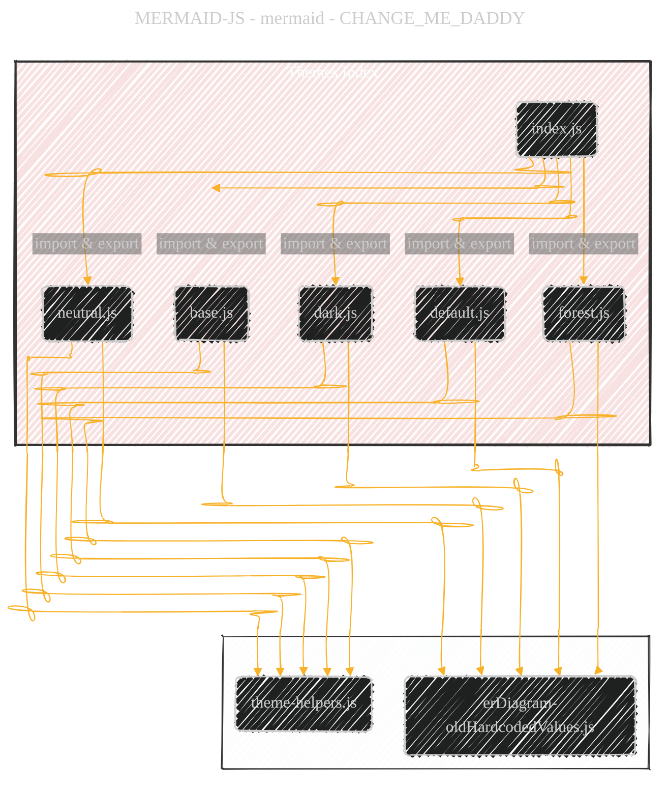
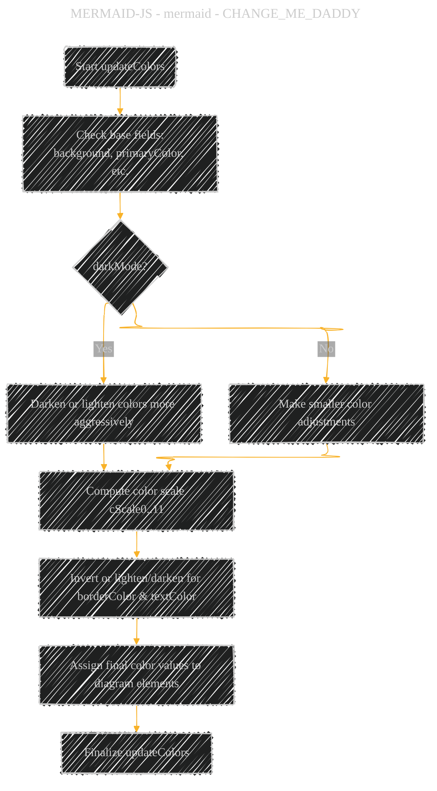
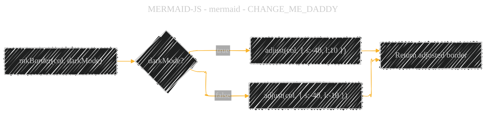

# JavaScript theme module comprehensive overview
> **Disclaimer:**
>
> This document contains my personal notes on the topic,
> compiled from publicly available documentation and various cited sources.
> The materials are intended for educational purposes, personal study, and reference.
> The content is dual-licensed:
> 1. **MIT License:** Applies to all code implementations (Swift, Mermaid, and other programming languages).
> 2. **Creative Commons Attribution 4.0 International License (CC BY 4.0):** Applies to all non-code content, including text, explanations, diagrams, and illustrations.
---

## A Diagrammatic Guide 

Below is a set of Mermaid diagrams that highlight key architectural and operational details of the theme-related code. Each diagram focuses on a particular aspect of the code: class structure, data flow for theme calculation, file dependencies, and color property handling.

━━━━━━━━━━━━━━━━━━━━━━━━━━━━
### Class Diagram: Theme Structures
━━━━━━━━━━━━━━━━━━━━━━━━━━━━
This diagram shows how each theme file defines a “Theme” class with certain properties and methods. It also indicates the shared pattern of “getThemeVariables” that wraps theme creation.

Notes: 
• “ThemeBase” represents a conceptual “parent” pattern encapsulating typical properties (not a literal class in the code, but a unifying concept).  
• Each derived class (Dark, Default, Forest, Neutral) redefines constructor fields and modifies color properties.  
• “getThemeVariables” returns a fully prepared theme object after the “calculate” routine processes any overrides.

━━━━━━━━━━━━━━━━━━━━━━━━━━━━
### File Dependency Flow
━━━━━━━━━━━━━━━━━━━━━━━━━━━━
Each theme file imports “mkBorder” from “theme-helpers.js” and some constants from “erDiagram-oldHardcodedValues.js.” The “index.js” file unifies the exported objects into a single dictionary.

Notes:  
• “index.js” collects all theme-related exports.  
• Each theme file relies on “theme-helpers.js” for color adjustments and border calculations and on “erDiagram-oldHardcodedValues.js” for legacy ER diagram attribute background colors.

━━━━━━━━━━━━━━━━━━━━━━━━━━━━
### Theme Creation Sequence
━━━━━━━━━━━━━━━━━━━━━━━━━━━━
This sequence shows how a theme object is created and updated before being returned for use.

Notes:  
• The client calls “getThemeVariables,” supplying override fields.  
• The theme class applies default colors, merges overrides, then reassigns them if needed.  
• Finally, the fully prepared theme is returned.

━━━━━━━━━━━━━━━━━━━━━━━━━━━━
### Color Adjustment Flowchart
━━━━━━━━━━━━━━━━━━━━━━━━━━━━
Each “updateColors” method in the theme classes manipulates primary, secondary, tertiary colors and sets a host of derived fields based on conditions such as “darkMode” or user overrides.

Notes:  
• The flow depends on whether “darkMode” is set, which changes how strongly certain base colors are shifted.  
• For each scale color, a matching “peer” or “inverted” version may be set.

━━━━━━━━━━━━━━━━━━━━━━━━━━━━
### “ThemeHelpers” Diagram: mkBorder
━━━━━━━━━━━━━━━━━━━━━━━━━━━━
The “mkBorder” function shows how border color is derived from a base color, factoring in whether dark mode is active.

Notes:  
• “mkBorder” uses “khroma” adjustments to produce an edge color that can be darker or lighter than the base color.  
• This approach ensures consistent contrast across themes.

━━━━━━━━━━━━━━━━━━━━━━━━━━━━
Additional Observations
━━━━━━━━━━━━━━━━━━━━━━━━━━━━
• Each theme class repeats a similar pattern: a constructor that sets color fields, then “updateColors,” applying color logic for specific diagram elements like flowcharts, Gantt charts, ER diagrams, etc.  
• “erDiagram-oldHardcodedValues.js” preserves certain legacy references to attribute background colors for ER diagrams.  

---
**Licenses:**

- **MIT License:**   - Full text in [LICENSE](LICENSE) file.
- **Creative Commons Attribution 4.0 International:**  - Legal details in [LICENSE-CC-BY](LICENSE-CC-BY) and at [Creative Commons official site](http://creativecommons.org/licenses/by/4.0/).

---