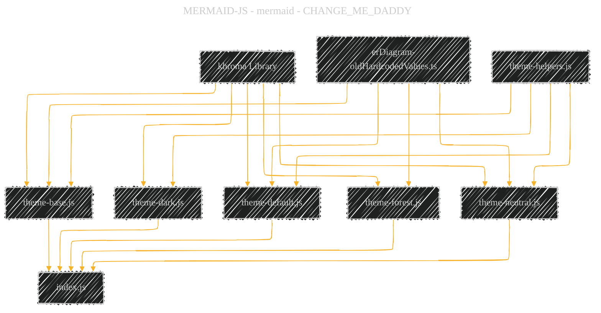
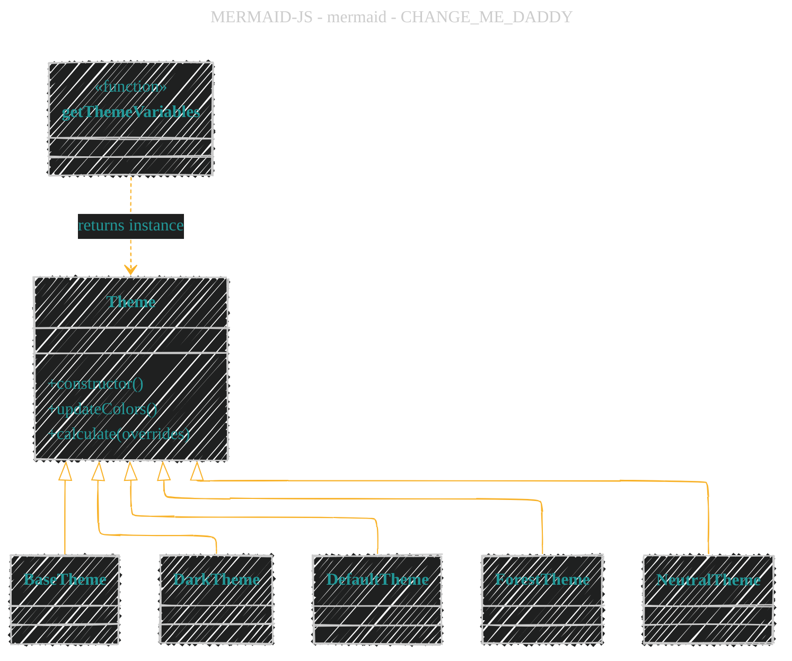
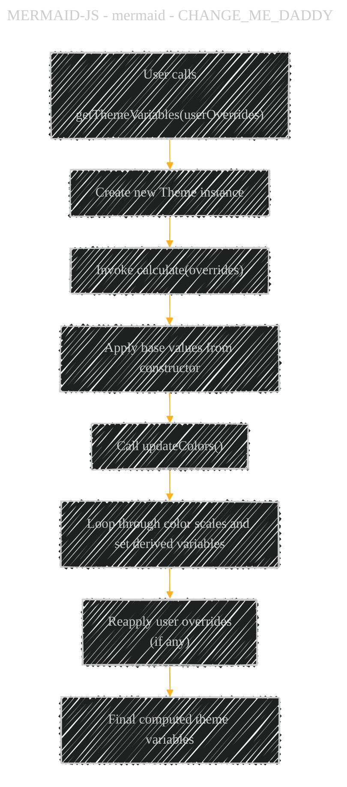
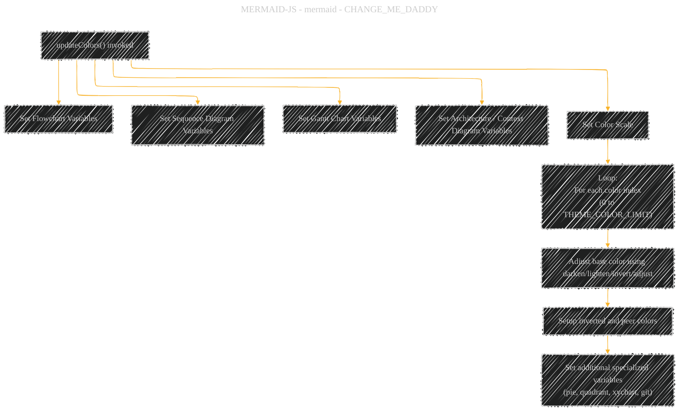

# JavaScript theme module comprehensive overview
> **Disclaimer:**
>
> This document contains my personal notes on the topic,
> compiled from publicly available documentation and various cited sources.
> The materials are intended for educational purposes, personal study, and reference.
> The content is dual-licensed:
> 1. **MIT License:** Applies to all code implementations (Swift, Mermaid, and other programming languages).
> 2. **Creative Commons Attribution 4.0 International License (CC BY 4.0):** Applies to all non-code content, including text, explanations, diagrams, and illustrations.
---

## A Diagrammatic Guide 

Below is a set of Mermaid diagrams that together illustrate the overall structure, dependencies, initialization flow, and internal workings of the theming system for Mermaid. These diagrams capture how the various theme modules (base, dark, default, forest, neutral) rely on shared resources, follow a common class structure with methods like updateColors and calculate, and perform complex color adjustments (using khroma and a helper mkBorder) to compute the final theme variables.

──────────────────────────────
### 1. File Dependency Diagram

This diagram shows the relationships between the core files in the theming subsystem. Notice how each theme module (base, dark, default, forest, neutral) depends on common modules such as the hardcoded values (erDiagram-oldHardcodedValues.ts), theme-helpers.js, and the khroma library used for color manipulation.

──────────────────────────────

### 2. Common Structure of Theme Classes

Each theme module defines a Theme class that follows a similar pattern. The class contains a constructor initializing base color values (primary, secondary, tertiary, background, etc.), an updateColors() method that performs detailed adjustments (including loops over a set limit for color scales), and a calculate() method that applies user overrides before calling updateColors() again. Finally, each module exports a getThemeVariables function that creates a new Theme instance.

──────────────────────────────

### 3. Theme Initialization Process Flow

This flowchart shows the process when a user calls getThemeVariables. A new Theme instance is created by one of the theme modules, then its calculate() method is invoked (which in turn calls updateColors after applying any overrides), and finally the computed theme object is returned.

──────────────────────────────
1. Breakdown of updateColors() Processing

Within updateColors(), the Theme class organizes variables by diagram type and category. The process includes sections for flowchart settings, sequence diagram properties, gantt chart color definitions, adjustments for color scales (using loops over a limit, inversion of colors, and peer adjustments), and finally setting values for specialized diagram types (pie, quadrant-graph, xychart, requirement diagrams, git-related colors, etc.).

──────────────────────────────
These diagrams together reveal the technical complexities of the theme system in Mermaid. They display how multiple theme modules reuse shared helper functions and hardcoded values; how each Theme class organizes a wide range of style variables using iterative adjustments; and how a consistent initialization pipeline (via calculate → updateColors) produces a rich set of theme variables tailored for different diagram types.

---
**Licenses:**

- **MIT License:**   - Full text in [LICENSE](LICENSE) file.
- **Creative Commons Attribution 4.0 International:**  - Legal details in [LICENSE-CC-BY](LICENSE-CC-BY) and at [Creative Commons official site](http://creativecommons.org/licenses/by/4.0/).

---