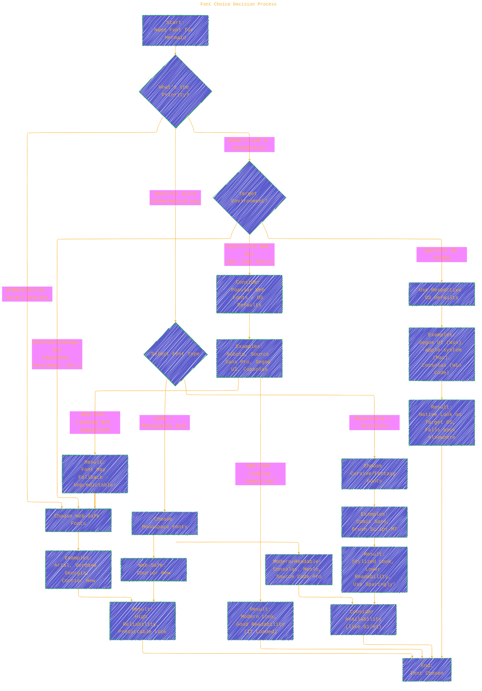

# Comprehensive Web Font Guide for Mermaid Diagrams
> **Disclaimer:**
>
> This document contains my personal notes on the topic,
> compiled from publicly available documentation and various cited sources.
> The materials are intended for educational purposes, personal study, and reference.
> The content is dual-licensed:
> 1. **MIT License:** Applies to all code implementations (Swift, Mermaid, and other programming languages).
> 2. **Creative Commons Attribution 4.0 International License (CC BY 4.0):** Applies to all non-code content, including text, explanations, diagrams, and illustrations.
---

## A Diagrammatic Guide 

This guide details various web fonts potentially usable in Mermaid diagrams, combining classic "web-safe" fonts with modern OS defaults and popular web fonts. It highlights technical aspects and potential issues to consider for reliable rendering.

### 1. Font Categorization and Origin

This mind map categorizes the fonts and provides a quick reference for their type and typical availability:

*   **[WS]**: Classic Web-Safe (Highest compatibility, expect broad availability)
*   **[MOD]**: Modern OS Default (High availability on specific OS - Win/Mac/iOS/Android)
*   **[PWF]**: Popular Web Font / Open Source (Often installed/cached, may require embedding)
*   **[O]**: Other (Less common, decorative, use with caution)

```mermaid
---
title: "Font Categorization and Origin"
author: "Cong Le"
version: "1.0"
license(s): "MIT, CC BY 4.0"
copyright: "Copyright (c) 2025 Cong Le. All Rights Reserved."
config:
  theme: base
---
%%%%%%%% Mermaid version v11.4.1-b.14
%%{
  init: {
    'fontFamily': 'Andale Mono, monospace',
    'mindmap': {
	    'nodeAlign': 'center',
	    'padding': 15
    },
    'themeVariables': {
      'primaryColor': '#FC82',
      'primaryTextColor': '#F8B229',
      'primaryBorderColor': '#27AE60',
      'secondaryColor': '#EBF3',
      'secondaryTextColor': '#6C3483',
      'secondaryBorderColor': '#A569BD',
      'fontSize': '20px'
    }
  }
}%%
mindmap
  root)"Web Fonts for Mermaid"(
    Sans_Serif))"Sans-Serif"((
      Helvetica("Helvetica<br>[WS]")
      Arial("Arial<br>[WS]")
      Arial_Black("Arial Black<br>[WS]")
      Verdana("Verdana<br>[WS]")
      Tahoma("Tahoma<br>[WS]")
      Trebuchet_MS("Trebuchet MS<br>[WS]")
      Impact("Impact<br>[WS]")
      Gill_Sans("Gill Sans<br>[WS]")
      Segoe_UI("Segoe UI<br>[MOD - Win]")
      apple_system("-apple-system / BlinkMacSystemFont<br>[MOD - Apple]")
      Calibri("Calibri<br>[MOD - Win/Office]")
      Roboto("Roboto<br>[PWF - Android/Google]")
      Source_Sans_Pro("Source Sans Pro<br>[PWF - Adobe]")
      Lato("Lato<br>[PWF - Google]")
    Serif))"Serif"((
      Times_New_Roman("Times New Roman<br>[WS]")
      Georgia("Georgia<br>[WS]")
      Palatino("Palatino<br>[WS]")
      Baskerville("Baskerville<br>[WS]")
      Cambria("Cambria<br>[MOD - Win/Office]")
      Source_Serif_Pro("Source Serif Pro<br>[PWF - Adobe]")
    Monospace))"Monospace"((
      Andale_Mono("Andalé Mono<br>[WS]")
      Courier("Courier<br>[WS]")
      Courier_New("Courier New<br>[WS]")
      Lucida("Lucida<br>(Console/Sans Typewriter)<br>[WS]")
      Monaco("Monaco<br>[MOD - Mac Classic]")
      Consolas("Consolas<br>[MOD - Win/Office]")
      Menlo("Menlo<br>[MOD - Mac]")
      Source_Code_Pro("Source Code Pro<br>[PWF - Adobe]")
      Fira_Mono_Fira_Code("Fira Mono / Fira Code<br>[PWF - Mozilla]")
    Cursive))"Cursive"((
      Comic_Sans_MS("Comic Sans MS [WS]<br>(Often debated category, technically cursive)")
      Bradley_Hand("Bradley Hand<br>[O]")
      Brush_Script_MT("Brush Script MT<br>[O]")
    Fantasy))"Fantasy"((
      Luminari("Luminari<br>[O]")
      
```

**Technical Notes on Mind Map:**

*   **Availability is Key:** The bracketed codes ([WS], [MOD], [PWF]) are crucial. Mermaid rendering relies on the font being available in the environment (browser, OS, rendering tool).
*   **System Fonts (`-apple-system`, etc.):** These aren't single fonts but CSS mechanisms to use the OS's preferred UI font. Support depends on the Mermaid rendering engine understanding these CSS values.
*   **Popular Web Fonts (`Roboto`, `Source Sans Pro`, etc.):** While common, they aren't guaranteed unless the specific Mermaid tool explicitly loads them (e.g., via `@font-face` in a web context) or the user has them installed.

---

### 2. Font Choice Decision Process

This flowchart outlines the thought process when selecting a font for your Mermaid diagram:

**Technical Notes on Flowchart:**

*   **Trade-offs:** The core decision is often compatibility vs. aesthetics/modernity.
*   **Environment Matters:** Where the Mermaid diagram will be viewed heavily dictates font choice. Simple Markdown viewers rarely load external fonts. Web applications have more flexibility.
*   **Fallbacks:** If a chosen font (especially [PWF] or [MOD]) isn't available *and* web fonts aren't loaded, the browser/viewer *will* substitute a default font (like Arial, Times New Roman, Courier). This can significantly alter the diagram's intended appearance and spacing.
*   **Readability:** For diagrams, readability is paramount. Highly decorative fonts ([O]) are generally discouraged for primary text.

---

### 3. Font Availability Tiers & Issues

This graph visualizes the different levels of font availability and the associated risks/considerations:

**Technical Notes on Availability Tiers:**

*   **Tier 1 (Web-Safe):** The most robust option for ensuring your diagrams render similarly for almost everyone, regardless of their OS or setup. The primary drawback is the limited selection and potentially dated look.
*   **Tier 2 (OS Default):** Excellent choice if you know your primary audience uses a specific OS (e.g., internal Windows tools using Segoe UI). Be prepared for fallbacks on other systems.
*   **Tier 3 (Popular Web/Open Source):** Offers the best balance of modern aesthetics and high-quality typography *if* the rendering environment supports web font loading (`@font-face`) or if you can reasonably expect users to have them installed (less reliable). This is common in web applications but rare in basic Markdown previews.
*   **Tier 4 (Decorative):** Generally unsuitable for primary diagram text due to readability and availability issues. Use only for specific, non-critical stylistic elements and ensure they can be loaded reliably.

---

### Summary and Potential Issues

*   **Core Issue - Availability:** The biggest challenge is ensuring the chosen font is available where the Mermaid diagram is rendered. Lack of availability leads to font substitution (fallback).
*   **Fallback Impact:** Font substitution can break the layout, spacing, and overall look of a diagram, as different fonts have different character widths and heights.
*   **Rendering Context:** A Mermaid diagram in a web app (using Mermaid.js) might support `@font-face` loading, making Tier 3 fonts viable. A static site generator or Markdown previewer might only have access to Tier 1 and Tier 2 fonts.
*   **SVG Output:** Mermaid typically renders to SVG. The SVG viewer must have access to the font. Embedding fonts directly into SVG increases file size significantly and is often not done by default.
*   **Licensing:** If using Tier 3 or Tier 4 fonts via `@font-face`, ensure the font license permits web embedding. Most popular Google Fonts and Open Source fonts (like Adobe's or Fira) allow this.
*   **Testing:** **Always test** your diagrams with your chosen font in the target viewing environment(s) to confirm rendering accuracy and handle potential fallbacks gracefully.

----

By understanding these categories, decision factors, and potential issues, you can make informed choices about which fonts to use in your Mermaid diagrams to balance visual appeal with reliable rendering. For maximum safety, stick to Tier 1; for modern looks in controlled environments, explore Tier 2 and Tier 3 carefully.

---
**Licenses:**

- **MIT License:**   - Full text in [LICENSE](LICENSE) file.
- **Creative Commons Attribution 4.0 International:**  - Legal details in [LICENSE-CC-BY](LICENSE-CC-BY) and at [Creative Commons official site](http://creativecommons.org/licenses/by/4.0/).

---
