```mermaid
---
title: "nanobind repo project"
author: "Cong Le"
version: "1.0"
license(s): "MIT, CC BY-SA 4.0"
copyright: "Copyright (c) 2025 Cong Le. All Rights Reserved."
config:
  layout: elk
  theme: base
  look: handDrawn
---
%%%%%%%% Mermaid version v11.4.1-b.14
%%%%%%%% Available curve styles include the following keywords:
%% basis, bumpX, bumpY, cardinal, catmullRom, linear, monotoneX, monotoneY, natural, step, stepAfter, stepBefore.
%%{
  init: {
    'flowchart': { 'htmlLabels': true, 'curve': 'basis' },
    'fontFamily': 'American Typewriter, monospace',
    'logLevel': 'fatal',
    'themeVariables': {
      'primaryColor': '#22BB',
      'primaryTextColor': '#F8B229',
      'lineColor': '#F8B229',
      'primaryBorderColor': '#27AE60',
      'secondaryColor': '#E2F1',
      'secondaryTextColor': '#6C3483',
      'secondaryBorderColor': '#A569BD',
      'fontSize': '20px'
    }
  }
}%%
flowchart TD
    %% Development Layer
    subgraph "Development"
        DevCpp["Developer C++ Code"]:::code
        NB_API["nanobind API"]:::code
        click NB_API "https://github.com/wjakob/nanobind/tree/master/include/nanobind/"
        Eigen["Eigen Support Headers"]:::storage
        click Eigen "https://github.com/wjakob/nanobind/tree/master/include/nanobind/eigen/"
        DevCpp -->|"#include"| NB_API
        DevCpp -->|"#include"| Eigen
    end

    %% Core Components
    NB_Core["nanobind Core"]:::code
    click NB_Core "https://github.com/wjakob/nanobind/tree/master/src/"
    RobinMap["robin_map Submodule"]:::storage
    click RobinMap "https://github.com/wjakob/nanobind/tree/master/ext/robin_map/"

    %% Build & Packaging Layer
    subgraph "Build & Packaging"
        BS["Build System (CMake & Bazel)"]:::build
        click BS "https://github.com/wjakob/nanobind/blob/master/CMakeLists.txt"
        click BS "https://github.com/wjakob/nanobind/tree/master/cmake/"
        click BS "https://github.com/wjakob/nanobind/blob/master/.gitmodules"
        PMC["pyproject.toml"]:::build
        click PMC "https://github.com/wjakob/nanobind/blob/master/pyproject.toml"
        BS -->|"pulls in headers & sources"| NB_API
        BS -->|"pulls in core"| NB_Core
        BS -->|"pulls in submodule"| RobinMap
        BS -->|"produces"| ExtMod
        BS -->|"configures package metadata"| PMC
    end

    %% Runtime Layer
    subgraph "Runtime"
        ExtMod["Extension Module (.so/.pyd)"]:::runtime
        PyInterp["Python Interpreter (CPython/PyPy)"]:::runtime
        Stub["stubgen.py"]:::script
        click Stub "https://github.com/wjakob/nanobind/blob/master/src/stubgen.py"
        Version["version.py"]:::script
        click Version "https://github.com/wjakob/nanobind/blob/master/src/version.py"
        Main["__main__.py"]:::script
        click Main "https://github.com/wjakob/nanobind/blob/master/src/__main__.py"

        ExtMod -->|"import → load"| PyInterp
        PyInterp -->|"executes"| Stub
        Stub -->|"emits .pyi stubs"| ExtMod
        PyInterp -->|"reads version"| Version
        PyInterp -->|"module entrypoint"| Main
    end

    %% Testing & Documentation Layer
    subgraph "Testing & Documentation"
        CppTest["C++ Test Harness (Google Test)"]:::test
        click CppTest "https://github.com/wjakob/nanobind/tree/master/tests/"
        PyTest["Python Test Suite (pytest)"]:::test
        click PyTest "https://github.com/wjakob/nanobind/tree/master/tests/"
        Docs["Documentation (Sphinx)"]:::doc
        click Docs "https://github.com/wjakob/nanobind/tree/master/docs/"

        CppTest -->|"invokes build"| BS
        PyTest -->|"imports extension"| ExtMod
        Docs -->|"reads headers & core"| NB_API
        Docs -->|"reads headers & core"| NB_Core
    end

    %% External Dependencies
    EigenDep["Python C-API & External Libraries"]:::storage

    %% Connections to External
    BS -->|"links against"| EigenDep
    NB_Core -->|"uses"| EigenDep
    ExtMod -->|"uses Python C-API"| EigenDep

    %% Styles
    classDef code fill:#D0E1F9,stroke:#4A90E2;
    classDef build fill:#C6E5B3,stroke:#3C763D;
    classDef runtime fill:#FDEBC4,stroke:#8A6D3B;
    classDef test fill:#F8D7DA,stroke:#A94442;
    classDef doc fill:#E2F0CB,stroke:#567D46;
    classDef storage fill:#CCCCCC,stroke:#666666;
    classDef script fill:#FBE4FA,stroke:#A64D79;
```

> ⚠️🏗️🚧🦺🧱🪵🪨🪚🛠️👷
> 
> This is a working draft in progress.
> 
> 
> 
> gif image is provided by [Giphy](https://giphy.com)
> 
> ⚠️🏗️🚧🦺🧱🪵🪨🪚🛠️👷

----


# wjakob - nanobind repo project
<details open>
<summary>Click to show/hide the full disclaimer.</summary>
   
> <ins>📢 **Disclaimer** 🚨</ins>
>
> This document contains my personal notes on the topic,
> compiled from publicly available documentation and various cited sources.
> The materials are intended for educational purposes (<ins>sometimes, entertainment purposes</ins>), personal study, and reference.
> The content is dual-licensed:
> 1. **MIT License:** Applies to all code implementations (Swift, Mermaid, and other programming languages).
> 2. **Creative Commons Attribution-ShareAlike 4.0 International License (CC BY-SA 4.0):** Applies to all non-code content, including text, explanations, diagrams, and illustrations.

</details>


----



----


```mermaid
---
title: "❓...CongLeSolutionX....❓"
author: "Cong Le"
version: "1.0"
license(s): "MIT, CC BY-SA 4.0"
copyright: "Copyright (c) 2025 Cong Le. All Rights Reserved."
config:
  theme: base
---
%%%%%%%% Mermaid version v11.4.1-b.14
%%{
  init: {
    'flowchart': { 'htmlLabels': false },
    'fontFamily': 'Bradley Hand',
    'themeVariables': {
      'primaryColor': '#fc82',
      'primaryTextColor': '#F8B229',
      'primaryBorderColor': '#27AE60',
      'secondaryColor': '#81c784',
      'secondaryTextColor': '#6C3483',
      'lineColor': '#F8B229',
      'fontSize': '20px'
    }
  }
}%%
flowchart LR
   My_Meme@{ img: "https://raw.githubusercontent.com/CongLeSolutionX/CongLeSolutionX/refs/heads/main/assets/images/My-meme-light-bulb-question-marks.png", label: "Ăn uống gì chưa ngừi đẹp?", pos: "b", w: 200, h: 150, constraint: "off" }

  Closing_quote@{ shape: braces, label: "...searching insights in the process of formulating better questions..." }

  Closing_quote ~~~ My_Meme
    
  Link_to_my_profile{{"<a href='https://github.com/CongLeSolutionX' target='_blank'>Click here if you care about my profile</a>"}}

  Closing_quote ~~~ My_Meme
  My_Meme animatingEdge@--> Link_to_my_profile
  
  animatingEdge@{ animate: true }

```

---
><b>Licenses</b>:
>
>- <b>MIT License</b>:  [](LICENSE) - Full text in [LICENSE](LICENSE) file.
>- <b>Creative Commons Attribution-ShareAlike 4.0 International</b>: [CC BY-SA 4.0](https://creativecommons.org/licenses/by-sa/4.0/) [](https://creativecommons.org/licenses/by-sa/4.0/) - Legal details in [LICENSE-CC-BY-SA-4.0](THE_PAST/LICENSE-CC-BY-SA-4.0) and at [Creative Commons official site](https://creativecommons.org/licenses/by-sa/4.0/).
>
---
