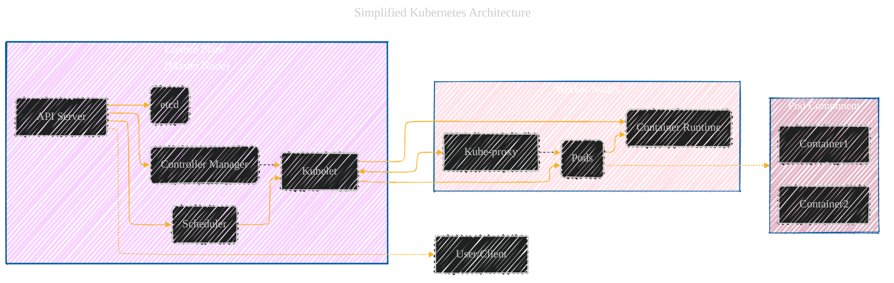

<div align="center">
	<h1>
		    <strong>ArchExplorer</strong>
	</h1>
</div>

<div align="center">
<h2>
	<ins>
		<em>Deconstructing Open-Source Architectures with Visualizations</em>
	</ins>
</h2>


[](LICENSE) [](LICENSE-CC-BY)

> Copyright © 2025 Cong Le. All Rights Reserved.

 
</div>


----
<details open>
	
<summary>Click to show/hide the full disclaimer.</summary>
 
> <ins>📢 **WARNING** 🚨</ins>
 
> **About This Project**
> - This repository documents my ongoing exploration at the intersection of digital art and artificial intelligence.

> **Purpose**
> - To publicly document academic research.
> - To share findings with the community.
> - To maintain a personal portfolio of creative and technical work.

> **Disclaimer**
> - This is a personal project.
> - Any user who shares, adapts, or builds upon this work is responsible for their own interpretations and applications.

> This document contains my personal notes on the topic,
> compiled from publicly available documentation and various cited sources.
> The materials are intended for 👨‍🎓 <ins>educational purposes</ins> 👨‍🎓 (<ins>sometimes, entertainment purposes</ins>), 📖 <ins> personal study </ins> 📖, and 🔖 <ins> technical reference </ins> 🔖.

> The content is dual-licensed:
> 1. **MIT License:** Applies to all code implementations (Swift, Mermaid, and other programming languages).
> 2. **Creative Commons Attribution-ShareAlike 4.0 International License (CC BY-SA 4.0):** Applies to all non-code content, including text, explanations, diagrams, and illustrations.

> ... and I'm still searching for a real job now.

</details>

---

<div align="center">
	
⚠️🏗️🚧🦺🧱🪵🪨🪚🛠️👷

This project is in progress...

<ins>...by a regular kid love mixing digital art and AI models to build things as hobby for my own academic research...<br/>and I'm looking for a job...</ins>


gif image is provided by [Giphy](https://giphy.com)

⚠️🏗️🚧🦺🧱🪵🪨🪚🛠️👷
	
</div>

----

Welcome to **ArchExplorer**!

This open-source project aims to demystify the architectures of popular open-source projects by breaking them down into clear, concise, and interactive visualizations. We primarily use `Mermaid.js` diagrams (sequence diagrams, flowcharts, class diagrams, state diagrams, etc.) to illustrate the components, interactions, and data flows within these systems.  Whether you're trying to understand a new codebase, contribute to an open-source project, learn about architectural patterns, or simply curious about how large systems are built, `ArchExplorer` provides a visual entry point.

**`ArchExplorer` is part of a larger initiative, alongside `AlgoVerse` and `Synthetic Zooniverse`, to make complex technical concepts more accessible through visualization. [AlgoVerse](https://github.com/CongLeSolutionX/AlgoVerse) focuses on algorithms, [Synthetic Zooniverse](https://github.com/CongLeSolutionX/Synthetic-Zooniverse) on AI models, and `ArchExplorer` on software architectures.  Together, they provide a comprehensive suite of resources for visual learning in computer science and software engineering.**

## Table of Contents

- [ArchExplorer: Deconstructing Open-Source Architectures with Visualizations](#archexplorer-deconstructing-open-source-architectures-with-visualizations)
  - [Table of Contents](#table-of-contents)
  - [About the Project](#about-the-project)
  - [Architectural Focus Areas](#architectural-focus-areas)
  - [Repository Structure](#repository-structure)
  - [Example Visualization: Simplified Kubernetes Architecture](#example-visualization-simplified-kubernetes-architecture)
  - [Getting Started](#getting-started)
    - [Prerequisites](#prerequisites)
    - [Cloning the Repository](#cloning-the-repository)
  - [Usage](#usage)
  - [🚀 Project Current Activities](#-project-current-activities)
  - [Contributing](#contributing)
  - [License](#license)
  - [Disclaimer](#disclaimer)
  - [Markdown and Visualization Resources](#markdown-and-visualization-resources)

---

## About the Project

**ArchExplorer** tackles the complexity of understanding large-scale software architectures.  Reading through thousands of lines of code can be daunting.  ArchExplorer provides a higher-level, visual overview that helps you:

*   **Grasp the Big Picture:**  Quickly understand the main components of a system and how they interact.
*   **Visualize Data Flow:**  See how data moves through the system, from user input to processing to storage and back.
*   **Identify Key Components:**  Pinpoint the critical parts of the architecture and their responsibilities.
*   **Understand Design Patterns:**  Recognize common architectural patterns (e.g., microservices, event-driven, layered) in practice.
*   **Learn by Example:**  Study the architectures of successful open-source projects to improve your own design skills.
*   **Facilitate Collaboration:** Use the visualizations as a shared understanding tool for teams working on open-source projects.
*   **Simplify Onboarding:** Help new contributors get up to speed quickly with a visual representation of the system.

We achieve this by:

*   **Creating Mermaid Diagrams:**  We use a variety of Mermaid diagram types to represent different aspects of the architecture.
*   **Providing Contextual Explanations:**  Each diagram is accompanied by clear, concise explanations of the components and interactions.
*   **Linking to Source Code:** Where possible, we provide links to relevant sections of the source code for deeper dives.
*   **Focusing on Clarity:**  We prioritize clarity and simplicity over exhaustive detail.  The goal is to provide an accessible overview, not a complete blueprint.
*   **Community Contributions:** We welcome contributions from the community to expand the library of visualized architectures.

**This project builds upon the visual learning principles established in [AlgoVerse](https://github.com/CongLeSolutionX/AlgoVerse) (algorithm visualization) and [Synthetic Zooniverse](https://github.com/CongLeSolutionX/Synthetic-Zooniverse) (AI model visualization), extending the approach to the realm of software architecture.**

---

## Architectural Focus Areas

<div align="center">
	
	<br/>
	<em>gif image is provided by <a href="https://giphy.com">Giphy</a></em>
</div>


ArchExplorer covers a wide range of open-source project architectures, including:

*   **Operating Systems:** (e.g., Linux Kernel, FreeBSD)
*   **Databases:** (e.g., PostgreSQL, Redis, MongoDB)
*   **Web Frameworks:** (e.g., React, Angular, Vue.js, Django, Ruby on Rails)
*   **Cloud Platforms:** (e.g., Kubernetes, Docker, OpenStack)
*   **Compilers and Interpreters:** (e.g., GCC, LLVM, V8 JavaScript Engine)
*   **Machine Learning Libraries:** (e.g., TensorFlow, PyTorch)
*   **Networking Tools:** (e.g., Nginx, Envoy)
*   **Mobile Applications**

---

## Repository Structure


<div align="center">
	
	<br/>
	<em>gif image is provided by <a href="https://giphy.com">Giphy</a></em>
</div>


The repository is organized by architectural focus area and then by individual project:

```
ArchExplorer/
├── LICENSE                   (MIT License text)
├── LICENSE-CC-BY             (Creative Commons BY 4.0 License text)
├── README.md                 (This file - project overview)
│
├── OperatingSystems/
│   ├── LinuxKernel/
│   │   ├── README.md         (Architecture overview, diagrams, and explanations)
│   │   └── diagrams/         (Directory containing Mermaid.js diagram source files)
│   │       ├── boot_process.mmd
│   │       ├── memory_management.mmd
│   │       └── ...
│   └── ... (Other operating systems)
│
├── Databases/
│   ├── PostgreSQL/
│   │   ├── README.md
│   │   └── diagrams/
│   │       └── ...
│   └── ... (Other databases)
│
├── WebFrameworks/
│   ├── React/
│   │   ├── README.md
│    │   └── diagrams/
│   │       └── ...
│   └── ... (Other web frameworks)
└── ... (Other architectural focus areas)
```

Each project folder contains:

*   **README.md:**  A detailed explanation of the project's architecture, including:
    *   An overview of the project's purpose and functionality.
    *   One or more Mermaid.js diagrams visualizing different aspects of the architecture.
    *   Explanations of the components, interactions, and data flows shown in the diagrams.
    *   Links to the project's official documentation and source code.
*   **diagrams/:**  A directory containing the `Mermaid.js` source files (`.md`) for the diagrams.  This allows you to easily modify and extend the diagrams.

---

## Example Visualization: Simplified Kubernetes Architecture

<div align="center">
	
	<br/>
	<em>gif image is provided by <a href="https://giphy.com">Giphy</a></em>
</div>


This example demonstrates how ArchExplorer uses Mermaid to illustrate the core components of Kubernetes.



**Component Explanations:**

*   **API Server:**  The central management point for the entire cluster.  Exposes the Kubernetes API.
*   **Scheduler:**  Assigns Pods to Worker Nodes based on resource availability and constraints.
*   **Controller Manager:**  Runs controller processes that regulate the state of the cluster (e.g., replication controller, endpoints controller).
*   **etcd:**  A distributed key-value store that holds the cluster's configuration and state.
*   **Kubelet:**  An agent that runs on each Worker Node and ensures that containers are running in Pods.
*   **Pods:**  The smallest deployable units in Kubernetes.  They contain one or more containers.
*   **Container Runtime:**  The software responsible for running containers (e.g., Docker, containerd).
*   **Kube-proxy:**  Maintains network rules on Worker Nodes and enables communication to Pods.

This diagram provides a high-level overview of the Kubernetes architecture.  More detailed diagrams could be created to explore specific aspects, such as the networking model or the storage architecture.

---

## Getting Started


<div align="center">
	
	<br/>
	<em>gif image is provided by <a href="https://giphy.com">Giphy</a></em>
</div>


### Prerequisites

*   **Web Browser:** A modern web browser that supports JavaScript and Mermaid.js.
*   **Code Editor (Optional):**  If you want to modify the Mermaid diagrams, you'll need a text editor or a code editor that supports Markdown and Mermaid.js.
*   **Git (Optional but Recommended):** for contribution and version control.

### Cloning the Repository

```bash
git clone [YOUR_REPOSITORY_URL]
```

Replace `[YOUR_REPOSITORY_URL]` with the actual URL of the ArchExplorer repository.

---

## Usage

1.  **Explore the Repository:** Navigate to the folders for the architectures you're interested in (e.g., `OperatingSystems/LinuxKernel`).
2.  **Read the README.md:** Start with the README.md file in each project's directory.  This will provide the architectural overview and diagrams.
3.  **Examine the Diagrams:**  View the Mermaid.js diagrams in the README.md files. You can also open the `.mmd` files in the `diagrams/` directory to see the source code and modify them.
4.  **Follow Links to Source Code:**  Use the provided links to explore the actual source code of the project.

---


## 🚀 Project Current Activities

<div align="center">
	
	<br/>
	<em>gif image is provided by <a href="https://giphy.com">Giphy</a></em>
</div>

<div align="left"><a name="project-current-activities"></a>

<details open>
<summary>Click to show/hide more on recent activities of this project </summary>

> powered by [OSS Insight](https://ossinsight.io)
<!-- All the diagrams below are made with [OSS Insight](https://ossinsight.io/) -->

| :bar_chart: Widget & Description | :art: Snapshot (Light Mode) |
|---|---|
| Active Contributors :technologist: of CongLeSolutionX/ArchExplorer - Last 28 days |  <br/> :link: [View Full Report :mag:](https://next.ossinsight.io/widgets/official/compose-recent-active-contributors?repo_id=945004235&limit=30) |
| Pushes :arrow_up: and Commits :writing_hand: of CongLeSolutionX/ArchExplorer |  <br/> :link: [View Full Report :mag:](https://next.ossinsight.io/widgets/official/analyze-repo-pushes-and-commits-per-month?repo_id=945004235) |
| Pull Request Size :straight_ruler: of CongLeSolutionX/ArchExplorer |  <br/> :link: [View Full Report :mag:](https://next.ossinsight.io/widgets/official/analyze-repo-pull-requests-size-per-month?repo_id=945004235) |
| Pull Request Lifecycle :arrows_counterclockwise: of CongLeSolutionX/ArchExplorer |  <br/> :link: [View Full Report :mag:](https://next.ossinsight.io/widgets/official/analyze-repo-pull-request-open-to-merged?repo_id=945004235) |
| Lines of Code Changes :computer::scroll: of CongLeSolutionX/ArchExplorer |  <br/> :link: [View Full Report :mag:](https://next.ossinsight.io/widgets/official/analyze-repo-loc-per-month?repo_id=945004235) |
| Commits Time Distribution :alarm_clock::date: of CongLeSolutionX/ArchExplorer |  <br/> :link: [View Full Report :mag:](https://next.ossinsight.io/widgets/official/analyze-repo-commits-time-distribution?repo_id=945004235&period=last_1_year&zone=0) | 


</details>

</div>


<div align="center">
	
	<br/>
	<em>gif image is provided by <a href="https://giphy.com">Giphy</a></em>
</div>


---

## Contributing

We welcome contributions! If you have new insights, model implementations, or research updates to share, please refer to the `CONTRIBUTING.md` (Not yet implemented will be updated later) for guidelines.


<!-- 
Contributions are highly encouraged! If you'd like to contribute an architectural visualization, please follow these guidelines:

1.  **Fork the Repository:**  Create a fork of the repository on your own GitHub account.
2.  **Create a Branch:** Create a new branch for your changes (e.g., `feature/add-redis-architecture`).
3.  **Choose a Project:** Select an open-source project whose architecture you want to visualize.
4.  **Create Diagrams:**  Use Mermaid.js to create clear and concise diagrams illustrating the architecture.  Focus on the most important components and interactions.
5.  **Write Explanations:**  Provide clear and concise explanations for each diagram.
6.  **Link to Source Code:**  Include links to relevant parts of the project's source code.
7.  **Follow the Structure:**  Adhere to the existing repository structure.
8.  **Create a Pull Request:** Submit a pull request to the main repository. Clearly describe your changes and the project you've visualized.
9.  **Code of Conduct:** Adhere to project code of conduct.

Please see the `CONTRIBUTING.md` file (to be created) for more detailed instructions and style guides. -->

---

## License

*   Code files within this repository (including the Mermaid.js diagram source files) are licensed under the [MIT License](LICENSE).
*   Documentation and textual explanations (README.md and associated files) are licensed under the [Creative Commons Attribution 4.0 International License (CC BY 4.0)](LICENSE-CC-BY).

---

## Disclaimer

The architectural visualizations provided in this repository are for educational and informational purposes only.  They are intended to provide a simplified overview and may not capture every detail of the actual architecture.  Always refer to the official project documentation for the most accurate and up-to-date information.

---

## Markdown and Visualization Resources

*   **Markdown Guide:** [https://www.markdownguide.org/](https://www.markdownguide.org/)
*   **GitHub Flavored Markdown Spec:** [https://github.github.com/gfm/](https://github.github.com/gfm/)
*   **Mermaid.js Documentation:** [https://mermaid.js.org/](https://mermaid.js.org/)
*   **Mermaid.js Live Editor:** [https://mermaid.live/](https://mermaid.live/)
*   **GitDiagram:** [https://github.com/ahmedkhaleel2004/gitdiagram/](https://github.com/ahmedkhaleel2004/gitdiagram/) -  <ins>*A primary source of inspiration for this project, leveraging LLMs to convert open-source projects into Mermaid diagrams.*</ins>

---

<!-- 


----
