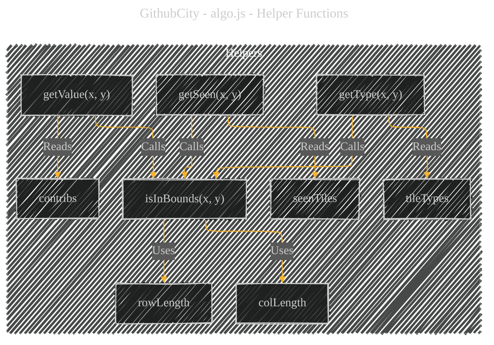
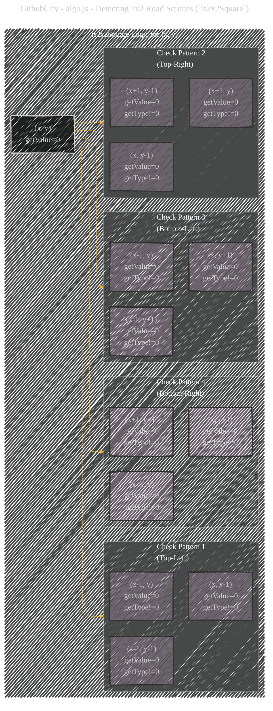
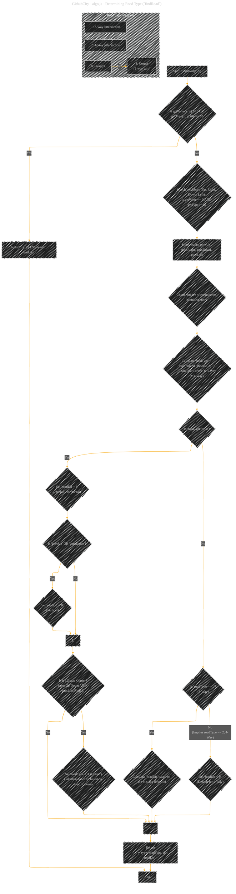
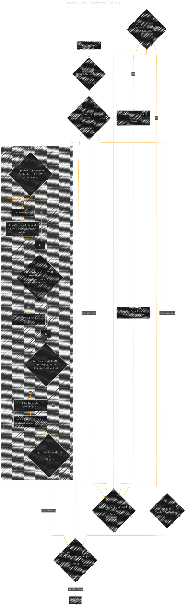

# algo.js - A Diagrammatic Guide
> **Disclaimer:**
>
> This document contains my personal notes on the topic,
> compiled from publicly available documentation and various cited sources.
> The materials are intended for educational purposes, personal study, and reference.
> The content is dual-licensed:
> 1. **MIT License:** Applies to all code implementations (Swift, Mermaid, and other programming languages).
> 2. **Creative Commons Attribution 4.0 International License (CC BY 4.0):** Applies to all non-code content, including text, explanations, diagrams, and illustrations.
---

This set of diagrams and explanations should provide a clear understanding of how the JavaScript code processes contribution data to generate a structured city layout grid.

---

## City Layout Generation Algorithms

This code defines functions to process a 2D array of "contribution" values (`contribs`) and generate a corresponding 2D array (`tileTypes`) that describes the type of tile (grass, road, building) and its specific characteristics (like road direction or building shape/model) for each coordinate in a city grid.

### Core Data Structures

These are the main data structures used throughout the process:

*   **`contribs`**: A 2D array representing the input map. A value of `0` suggests a potential road or open space, while a value greater than `0` suggests a potential building site, with the value possibly indicating its height or importance.
*   **`tileTypes`**: A 2D array of the same dimensions as `contribs`. Each element will store an object describing the tile at that position (e.g., `{ tile: 1, type: 0, dir: 1 }` for a straight road, or `{ tile: 2, type: 1, building: {...}, dir: 0, value: 5 }` for a 1x2 building). Initially filled with `-1`.
*   **`seenTiles`**: A 2D array used primarily during building detection to mark tiles that have already been processed as part of a larger building structure, preventing redundant checks. Initially filled with `0`.
*   **`rowLength`, `colLength`**: Store the dimensions of the grid derived from `contribs`.

---

### 1. Initialization (`initializeTiles`)

This function sets up the necessary data structures based on the input `contribs`.

**Explanation:**
The `initializeTiles` function prepares the global state for the layout generation. It stores the input contribution data, resets the output (`tileTypes`) and tracking (`seenTiles`) arrays, determines the grid size, and then fills `tileTypes` with `-1` (unprocessed) and `seenTiles` with `0` (unseen) for every cell.

---

### 2. Helper Functions

Several helper functions are used to access data and check conditions safely.

*   **`getValue(x, y)`**: Returns the contribution value at `(x, y)`, or `-1` if out of bounds.
*   **`getType(x, y)`**: Returns the `tileTypes` object at `(x, y)`, or an empty object `{}` if out of bounds.
*   **`getSeen(x, y)`**: Returns the `seenTiles` value (0 or 1) at `(x, y)`, or `-1` if out of bounds.
*   **`isInBounds(x, y)`**: Returns `true` if `(x, y)` is within the grid boundaries, `false` otherwise.

---

### 3. Detecting 2x2 Road Squares (`is2x2Square`)

This function checks if placing a road at `(x, y)` (where `getValue(x,y) == 0`) would create an undesirable 2x2 square of road tiles. It checks the three relevant neighbors in the four diagonal directions.

**Explanation:**
`is2x2Square(x, y)` checks if the tile at `(x, y)` is part of a potential 2x2 road block. It iterates through the four diagonal neighbors (`i`, `j` loops of +/-1). For each diagonal direction, it checks if the adjacent horizontal, adjacent vertical, and the diagonal tile itself *all* have `getValue === 0` and are *not* already grass (`getType(..).tile !== 0`). If such a 2x2 pattern is found in any of the four diagonal possibilities relative to `(x, y)`, it returns `true`. This is used later to prevent forming these squares by turning one tile into grass.

----

### 4. Determining Road Type (`findRoad`)

This function analyzes the neighbors of a potential road tile `(x, y)` (where `getValue === 0`) to determine its type (straight, 3-way, 4-way, or corner) and orientation.

**Explanation:**
1.  It first checks if the given `(x, y)` is a valid candidate for a road (must have `getValue === 0` and not already be marked as grass `tile === 0`).
2.  It checks the four adjacent neighbors to see if they are also potential road tiles.
3.  It counts the number of connecting neighbors (`numNeighbors`).
4.  The basic `roadType` is determined: 0 neighbors or 1 neighbor results in `roadType = 0`; 2 neighbors gives `roadType = 0`; 3 neighbors gives `roadType = 1`; 4 neighbors gives `roadType = 2`.
5.  If `roadType` is 0 (straight or corner):
    *   It defaults to horizontal (`roadDir = 1`).
    *   If connected vertically, it sets to vertical (`roadDir = 0`).
    *   It then specifically checks if it forms a 2-way corner (e.g., up and right). If so, it overrides `roadType` to `3` and sets the appropriate `roadDir` for the corner.
6.  If `roadType` is 1 (3-way): It calculates `roadDir` based on which of the four directions is *not* connected.
7.  If `roadType` is 2 (4-way): `roadDir` is set to `0` (default orientation).
8.  Returns the coordinates, determined `type`, and `dir`.

----

### 5. Determining Building Type (`findBuilding`)

This complex function identifies building clusters starting from a tile `(x, y)` with `getValue > 0`. It determines if the building is 1x1, 1x2, or L-shaped, marks the involved tiles as `seen`, and selects a building model.

```mermaid
---
title: "GithubCity - algo.js - Determining Building Type (`findBuilding`)"
author: "Cong Le"
version: "1.0"
license(s): "MIT, CC BY 4.0"
copyright: "Copyright (c) 2025 Cong Le. All Rights Reserved."
config:
  layout: elk
  look: handDrawn
  theme: dark
---
%%%%%%%% Mermaid version v11.4.1-b.14
%%%%%%%% Toggle theme value to `base` to activate the initilization below for the customized theme version.
%%%%%%%% Available curve styles include the following keywords:
%% basis, bumpX, bumpY, cardinal, catmullRom, linear, monotoneX, monotoneY, natural, step, stepAfter, stepBefore.
%%{
  init: {
    'flowchart': {'htmlLabels': true, 'curve': 'basis' },
    'fontFamily': 'Fantasy',
    'themeVariables': {
      'primaryColor': '#ffff',
      'primaryTextColor': '#2ff9',
      'primaryBorderColor': '#7c2',
      'lineColor': '#F8B229',
      'secondaryColor': '#006100',
      'tertiaryColor': '#fff'
    }
  }
}%%
flowchart TD
    A["Start: findBuilding(x, y, val)"] --> B("Initialize 'res' object, 'neighborCoords' array")
    B --> C("Mark 'seenTiles[y][x] = 1'")
    C --> D{"Check adjacent neighbors<br>(Up, Right, Down, Left)"}
    D --> E{"For each neighbor: Is 'getValue == val' AND 'getSeen == 0'?"}
    E -- Yes --> F(Add neighbor coords and direction to `neighborCoords`);
    F --> E
    E -- No / Done Checking --> G{"Is 'neighborCoords.length >= 1'?"}

    G -- No<br>(No adjacent neighbors) --> H{"Set 'res.type = 0'<br>(1x1 Building)"}
    H --> I{"Set 'res.dir = random(0-3)'"}
    I --> Z

    G -- Yes --> J{"Set 'res.dir = 0', 'found = false'"}
    J --> K{"Loop through Corner positions relative to (x, y)<br>('j' in '[1, -1]', 'i' in '[j*-1, j]')"}
    K --> L{"Is corner '(x+j, y+i)' 'getValue == val' AND 'getSeen == 0'?"}
    L -- Yes --> M{"Check potential L-shape centers between (x,y) and corner"}
    M --> N{"Is either center 'getValue == val' AND 'getSeen == 0'?"}
    N -- Yes --> O{"Set 'res.type = 2' (L-Shape)<br>Mark center and corner as seen ('seenTiles = 1')<br>Set 'res.mirror' flag<br>Set 'found = true', Break loops"}
    N -- No --> P
    L -- No --> P{"Increment 'res.dir'"}
    P --> Q{"Is 'found == true'?"}
    Q -- Yes --> R
    Q -- No --> K
    K -- Loop finished --> R
    O --> R

    R --> S{"Was an L-shape found<br>('res.type != -1')?"}
    S -- No --> T{"Set 'res.type = 1'<br>(1x2 Building)"}
    T --> U{"Mark first neighbor in 'neighborCoords' as seen<br>('seenTiles = 1')"}
    U --> V{"Set 'res.dir' based on first neighbor's direction"}
    V --> Z
    S -- Yes<br>(L-shape was found) --> Z


    Z --> ZA{"Is 'res.type != -1'?<br>(Building type determined)"}
    ZA -- Yes --> ZB{"Filter 'BUILDING_TYPES[res.type]' based on 'val'<br>(min/max)"}
    ZB --> ZC{"Calculate 'idx' using '(x * y * val) % types.length'<br>(Deterministic model selection)"}
    ZC --> ZD{"Set 'res.building = types[idx]'"}
    ZD --> ZFINAL
    ZA -- No --> ZFINAL

    ZFINAL --> ZEND["Return 'res'"]
    
```

**Explanation:**
1.  Marks the starting tile `(x, y)` as seen.
2.  Checks the four adjacent neighbors. If any have the same `val` and haven't been seen, they are added to `neighborCoords`.
3.  **If no adjacent neighbors found:** It's a 1x1 building (`type = 0`), assigned a random direction.
4.  **If adjacent neighbors exist:**
    *   It first attempts to find an L-shaped pattern (`type = 2`). It iterates through the four corner positions relative to `(x, y)`.
    *   For a valid corner neighbor, it checks the two intermediate tiles that would form an 'L' with the start tile and the corner tile.
    *   If an L-pattern is found, the type is set to 2, the corner and intermediate tiles are marked as seen, the direction (`dir`) is determined by which corner was found, a `mirror` flag might be set, and the search stops.
    *   If no L-shape is found after checking all corners, it defaults to a 1x2 building (`type = 1`).
    *   The first neighbor found is marked as seen, and the building's direction (`dir`) is set based on that neighbor's relative position.
5.  Finally, if a building type was determined (`type != -1`):
    *   It filters the available `BUILDING_TYPES` for that shape based on the building's value (`val`) fitting within the `min` and `max` range defined for the models.
    *   It selects a specific model deterministically using the coordinates and value (`(x * y * val) % types.length`).
    *   The chosen building model details are added to the result.
6.  Returns the `res` object containing coordinates, type, direction, building model info, value, etc.

----

### 6. Main Algorithm (`findTiles`)

This is the main function that orchestrates the entire layout generation process.

**Explanation:**
1.  **2x2 Square Removal:** It iterates through the grid (skipping every other row for efficiency, though the inner loop checks all columns). If it finds a potential road tile `(getValue == 0)` that would form a 2x2 road square (`is2x2Square`), it preemptively sets that tile to grass (`tileTypes[y][x] = { tile: 0 }`) and skips the next `x` coordinate to avoid redundant checks.
2.  **Tile Identification:** It iterates through every tile `(x, y)` in the grid.
    *   **Roads:** If `getValue == 0` and the tile hasn't been set to grass (`getType().tile != 0`), it calls `findRoad` to determine the road type/direction and updates `tileTypes`.
    *   **Implicit Grass:** If `getValue == 0` but the tile *was* marked as `seen` (likely by `findBuilding` processing an adjacent L-shape or 1x2 building) and isn't already a road (`getType().tile != 1`), it's set explicitly to grass (`{ tile: 0 }`). This cleans up spaces occupied by building logic but not part of the building itself.
    *   **Buildings:** If `getValue > 0` and the tile hasn't been `seen` yet, it calls `findBuilding`. `findBuilding` handles identifying the shape (1x1, 1x2, L), marking all involved tiles as `seen`, choosing a model, and the result is stored in `tileTypes` for the starting tile `(x, y)`. The other tiles belonging to the same building are implicitly handled because they are marked `seen`.
3.  After iterating through all tiles, the `tileTypes` array contains the complete city layout information.

---
**Licenses:**

- **MIT License:**   - Full text in [LICENSE](LICENSE) file.
- **Creative Commons Attribution 4.0 International:**  - Legal details in [LICENSE-CC-BY](LICENSE-CC-BY) and at [Creative Commons official site](http://creativecommons.org/licenses/by/4.0/).

---
