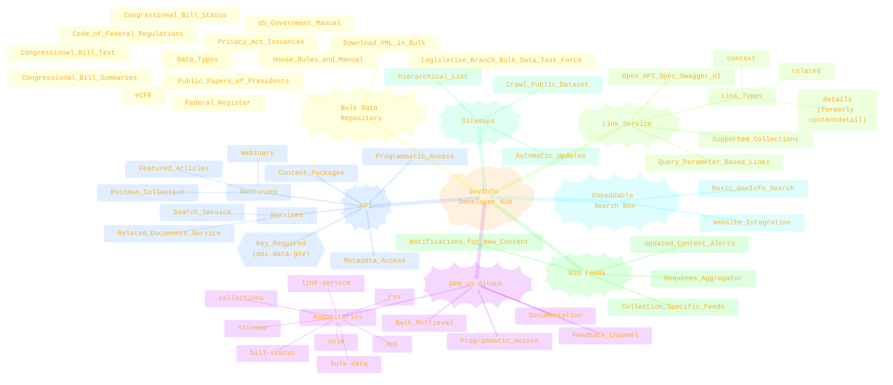
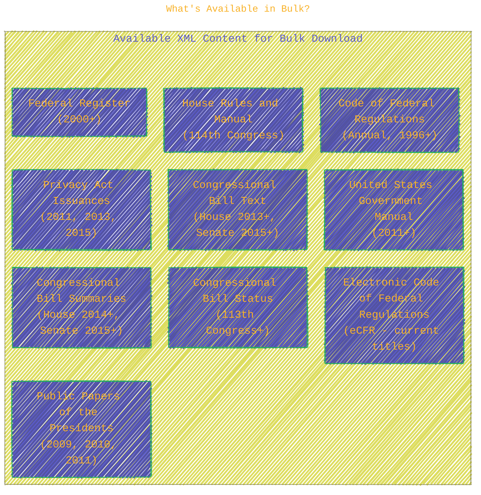
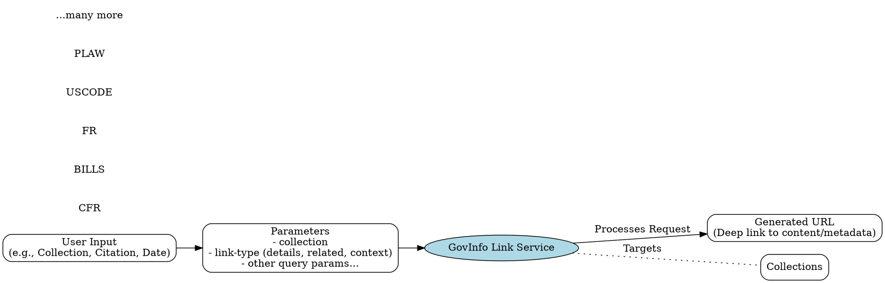

> ⚠️🏗️🚧🦺🧱🪵🪨🪚🛠️👷
> 
> This is a working draft in progress
> 
> 
>
> gif image is provided by [Giphy](https://giphy.com)
> 
> ⚠️🏗️🚧🦺🧱🪵🪨🪚🛠️👷

----

# GovInfo Developer Hub

Click to show/hide the full disclaimer.

   
> <ins>📢 **Disclaimer** 🚨</ins>
>
> This document contains my personal notes on the topic,
> compiled from publicly available documentation and various cited sources.
> The materials are intended for educational purposes (<ins>sometimes, entertainment purposes</ins>), personal study, and reference.
> The content is dual-licensed:
> 1. **MIT License:** Applies to all code implementations (Swift, Mermaid, and other programming languages).
> 2. **Creative Commons Attribution-ShareAlike 4.0 International License (CC BY-SA 4.0):** Applies to all non-code content, including text, explanations, diagrams, and illustrations.

---

## GovInfo Developer Hub: An Overview 🗺️

The U.S. Government Publishing Office (GPO) provides a rich ecosystem for developers to access and work with government information. The GovInfo Developer Hub is central to this, offering tools, data, and documentation.

Here's a bird's-eye view of what the Hub encompasses:

---

## GPO on GitHub: Your Development Partner 🤝

GPO leverages [GitHub](https://github.com/usgpo) as a primary platform for developer engagement. It's the go-to place for documentation, tools for programmatic access, and a way to provide feedback. 📝

### Key GitHub Repositories 🗂️

GPO maintains several repositories, each serving a distinct purpose:

```plantuml
/'
title: Key GitHub Repositories
author: Cong Le
version: 1.0
license(s): MIT, CC BY-SA 4.0
copyright: Copyright (c) 2025 Cong Le. All Rights Reserved.
'/
@startuml
package "GPO GitHub Repositories" {
  component [api] as api_repo <<Service>>
  note right of api_repo : Services to access GovInfo content & metadata
  component [bill-status] as bill_status_repo <<Data>>
  note right of bill_status_repo : Sample Bill Status XML files & user guide
  component [bulk-data] as bulk_data_repo <<Docs>>
  note right of bulk_data_repo : User guides for XML on Bulk Data Repository
  component [collections] as collections_repo <<Metadata>>
  note right of collections_repo : Info on FDsys metadata, regex
  component [link-service] as link_service_repo <<Service>>
  note right of link_service_repo : Create links to content & metadata
  component [rss] as rss_repo <<Service>>
  note right of rss_repo : Notifications for new GovInfo content
  component [sitemap] as sitemap_repo <<Service>>
  note right of sitemap_repo : Sitemaps to crawl for content & metadata
  component [uslm] as uslm_repo <<Schema>>
  note right of uslm_repo : United States Legislative Markup (USLM) XML Schema
}

actor Developer

Developer --> api_repo : Uses
Developer --> bill_status_repo : Uses
Developer --> bulk_data_repo : Uses
Developer --> collections_repo : Uses
Developer --> link_service_repo : Uses
Developer --> rss_repo : Uses
Developer --> sitemap_repo : Uses
Developer --> uslm_repo : Uses

@enduml
```

*   **[api](https://github.com/usgpo/api):** Provides services to access GovInfo content and metadata.
*   **[bill-status](https://github.com/usgpo/bill-status):** Contains sample Bill Status XML files and a user guide.
*   **[bulk-data](https://github.com/usgpo/bulk-data):** Offers user guides for XML on the GovInfo Bulk Data Repository.
*   **[collections](https://github.com/usgpo/collections):** Details FDsys metadata, including useful regular expressions.
*   **[link-service](https://github.com/usgpo/link-service):** Enables programmatic creation of links to content and metadata.
*   **[rss](https://github.com/usgpo/rss):** Facilitates notifications for new GovInfo content and metadata.
*   **[sitemap](https://github.com/usgpo/sitemap):** Provides sitemaps for crawling content and metadata.
*   **[uslm](https://github.com/usgpo/uslm):** Defines the United States Legislative Markup (USLM) XML Schema.

---

## The GovInfo API: Programmatic Access Unlocked 🔑

The [GovInfo API](https://api.govinfo.gov/docs) (also on [GitHub](https://github.com/usgpo/api)) allows developers to programmatically tap into GovInfo's vast collection of content and metadata, all neatly packaged. 💻

### Accessing the API: A Quick Flow

```mermaid
---
title: "Accessing the API: A Quick Flow"
author: "Cong Le"
version: "1.0"
license(s): "MIT, CC BY-SA 4.0"
copyright: "Copyright (c) 2025 Cong Le. All Rights Reserved."
config:
  layout: elk
  theme: base
  look: handDrawn
---
%%%%%%%% Mermaid version v11.4.1-b.14
%%%%%%%% Available curve styles include the following keywords:
%% basis, bumpX, bumpY, cardinal, catmullRom, linear, monotoneX, monotoneY, natural, step, stepAfter, stepBefore.
%%{
  init: {
    'flowchart': { 'htmlLabels': true, 'curve': 'basis' },
    'fontFamily': 'American Typewriter, monospace',
    'logLevel': 'fatal',
    'themeVariables': {
      'primaryColor': '#22BB',
      'primaryTextColor': '#F8B229',
      'lineColor': '#F8B229',
      'primaryBorderColor': '#27AE60',
      'secondaryColor': '#E2F1',
      'secondaryTextColor': '#6C3483',
      'secondaryBorderColor': '#A569BD',
      'fontSize': '20px'
    }
  }
}%%
flowchart TD
    A[Developer Wants to Use API] --> B{Need API Key?}
    B -- Yes --> C[Visit api.data.gov]
    C --> D[Sign Up for a Key]
    D --> E[Receive API Key ✨]
    B -- No / Already Have Key --> F[Use API Key in Requests]
    E --> F
    F --> G[Access GovInfo Content & Metadata]
    G --> H[Develop Application! 🥳]
```

For more details, you can [sign up for a key here](https://www.govinfo.gov/api-signup).

### API Resources at Your Fingertips 📚

GPO provides several resources to help you master the API:
*   **[Featured API Articles](https://www.govinfo.gov/app/search/curated/API/):** Stay updated with the latest information.
	*   [New GovInfo API (2018)](https://www.govinfo.gov/features/api)
	*   [API - Related Documents Service (2021)](https://www.govinfo.gov/features/api-related-document-service)
	*   [API Search Service (2023)](https://www.govinfo.gov/features/search-service-overview)
*   **Webinars** 🎬: Visual demonstrations of API functionality.
	*   [GovInfo API Overview and Search Service Preview (2023)](https://www.fdlp.gov/training/govinfo-api-overview-and-search-service-preview)
	*   [2023 Fall DLC: GovInfo Enhancements & New API Search Service (2023)](https://www.fdlp.gov/training/2023-fall-dlc-govinfo-enhancements-new-api-search-service) (Search Service demo starts around 21:00)
*   **Additional Tools** 🛠️:
	*   [Postman collection for Search Service](https://www.fdlp.gov/training/govinfo-api-overview-and-search-service-preview): A JSON file for the popular API tool, Postman.

---

## Bulk Data Repository: Get It All! 📦

For those who need large datasets, the [GovInfo Bulk Data Repository](https://www.govinfo.gov/bulkdata) (see user guides on [GitHub](https://github.com/usgpo/bulk-data)) allows downloading select collections as XML. This is perfect for data-intensive projects and mashups. GPO is also a member of the Legislative Branch Bulk Data Task Force, promoting open access to legislative information.

### What's Available in Bulk?

---

## Link Service: Create Smart Links 🔗

The [GovInfo Link Service](https://www.govinfo.gov/link-docs) (documentation on [GitHub](https://github.com/usgpo/link-service)) lets you generate dynamic, query-based links to content and metadata. It's built using [Open API Spec](https://github.com/OAI/OpenAPI-Specification) and [Swagger UI](https://github.com/swagger-api/swagger-ui) for ease of use.

### Key Link Service Features

*   **Replaces FDsys Link Service:** Offers all previous functionality.
*   **Improved Link Types:**
	*   `link-type: "details"` (replaces "contentdetail")
	*   New `link-type: "related"`
	*   New `link-type: "context"`
*   **Supported Collections:**
	*   Code of Federal Regulations (CFR)
	*   Compilation of Presidential Documents (CPD)
	*   Congressional Bills (BILLS)
	*   And many more as listed in the document! (Congressional Calendars, Committee Prints, Documents, Hearings, Record, Reports, Public/Private Laws, Statutes at Large, US Code).

---

## RSS Feeds: Stay Updated Automatically 📰

Get notified about new and updated content through [GovInfo RSS feeds](https://www.govinfo.gov/feeds) (repo at [GitHub](https://github.com/usgpo/rss)). Subscribe to feeds for specific collections or courts.

### How RSS Feeds Work

```mermaid
---
title: "How RSS Feeds Work"
author: "Cong Le"
version: "0.1"
license(s): "MIT, CC BY 4.0"
copyright: "Copyright (c) 2025 Cong Le. All Rights Reserved."
config:
  layout: elk
  theme: base
---
%%%%%%%% Mermaid version v11.4.1-b.14
%%{
  init: {
    'sequence': { 'mirrorActors': true, 'showSequenceNumbers': true, 'actorMargin': 50 },
    'fontFamily': 'Monaco',
    'themeVariables': {
      'textColor': '#F8B229',
      'actorBkg': '#22B8',
      'actorBorder': '#7C0000',
      'actorTextColor': '#E2E',
      'actorLineColor': '#E22E',
      'activationBkgColor': '#FBBF',
      'tertiaryColor': '#fff',
      'fontSize': '15px',
      'signalColor': '#F93B',
      'signalTextColor': '#2FBE',
      'sequenceNumberColor': '#000'
    }
  }
}%%
sequenceDiagram
    actor User
    participant RSS_Aggregator as RSS Aggregator 💻
    participant GovInfo_RSS_Feed as GovInfo RSS Feed 📡

    User->>RSS_Aggregator: Subscribes to GovInfo RSS Feed
    loop Check for Updates
        RSS_Aggregator->>GovInfo_RSS_Feed: Polls for new/updated content
        alt Content Available
            GovInfo_RSS_Feed-->>RSS_Aggregator: Delivers XML update
            RSS_Aggregator-->>User: Displays new content item
        else No New Content
            GovInfo_RSS_Feed-->>RSS_Aggregator: No updates
        end
    end
```

**Note:** An RSS aggregator software is needed to subscribe to and read these feeds. During large reprocessing, update notifications for some collections might be temporarily suspended to avoid flooding feeds.

---

## Sitemaps: Efficient Crawling 🗺️

[GovInfo Sitemaps](https://www.govinfo.gov/sitemaps) (repo at [GitHub](https://github.com/usgpo/sitemap)) offer a hierarchical list of all public content, updated as new items are added. This allows developers to efficiently crawl the dataset and detect new content.

### Using Sitemaps

```mermaid
---
title: "Using Sitemaps"
author: "Cong Le"
version: "1.0"
license(s): "MIT, CC BY-SA 4.0"
copyright: "Copyright (c) 2025 Cong Le. All Rights Reserved."
config:
  layout: elk
  theme: base
  look: handDrawn
---
%%%%%%%% Mermaid version v11.4.1-b.14
%%%%%%%% Available curve styles include the following keywords:
%% basis, bumpX, bumpY, cardinal, catmullRom, linear, monotoneX, monotoneY, natural, step, stepAfter, stepBefore.
%%{
  init: {
    'flowchart': { 'htmlLabels': true, 'curve': 'basis' },
    'fontFamily': 'American Typewriter, monospace',
    'logLevel': 'fatal',
    'themeVariables': {
      'primaryColor': '#22BB',
      'primaryTextColor': '#F8B229',
      'lineColor': '#F8B229',
      'primaryBorderColor': '#27AE60',
      'secondaryColor': '#E2F1',
      'secondaryTextColor': '#6C3483',
      'secondaryBorderColor': '#A569BD',
      'fontSize': '20px'
    }
  }
}%%
flowchart TD
    A["Developer/Crawler Wants All Content Links"] --> B["Access GovInfo Sitemaps"]
    B --> C{"Sitemap Index File"}
    C --> D["Lists Individual Sitemaps<br/>(often by collection/date)"]
    D --> E["Individual Sitemap File"]
    E --> F["List of URLs for Content Packages"]
    F --> G["Crawl URLs to Retrieve Content/Metadata"]
    G --> H["Efficiently Discover New & Existing Content ✅"]
```

----

## Embed the Search Box on Your Website 🔍

Web managers can easily integrate GovInfo's search functionality into their own websites using a search widget. This allows users to perform basic searches directly on GovInfo. [Find out how →](https://www.govinfo.gov/help#search-box)

----

<!-- 

---
>**Licenses:**
>
>- **MIT License:**   - Full text in [LICENSE](LICENSE) file.
>- **Creative Commons Attribution-ShareAlike 4.0 International**: [CC BY-SA 4.0](https://creativecommons.org/licenses/by-sa/4.0/)  - Legal details in [LICENSE-CC-BY-SA-4.0](THE_PAST/LICENSE-CC-BY-SA-4.0) and at [Creative Commons official site](https://creativecommons.org/licenses/by-sa/4.0/).
>
---
